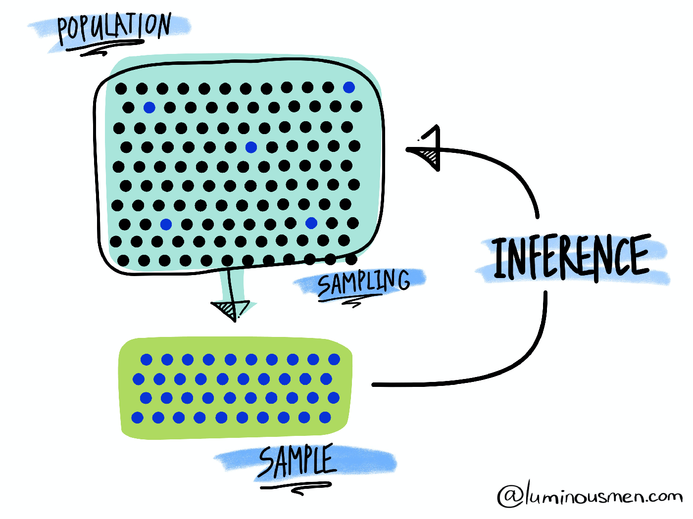
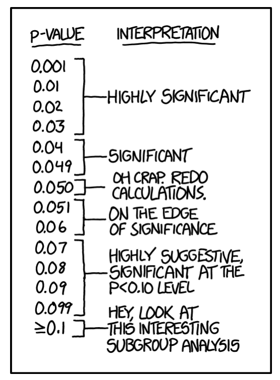

```{R, setup, include = F}
# devtools::install_github("dill/emoGG")
library(pacman)
p_load(
  broom, tidyverse,
  latex2exp, ggplot2, ggthemes, ggforce, viridis, extrafont, gridExtra,
  kableExtra, snakecase, janitor,
  data.table, dplyr, estimatr,
  lubridate, knitr, parallel,
  lfe,
  here, magrittr
)
# Define pink color
red_pink <- "#e64173"
turquoise <- "#20B2AA"
orange <- "#FFA500"
red <- "#fb6107"
blue <- "#2b59c3"
green <- "#8bb174"
grey_light <- "grey70"
grey_mid <- "grey50"
grey_dark <- "grey20"
purple <- "#6A5ACD"
slate <- "#314f4f"
# Dark slate grey: #314f4f
# Knitr options
opts_chunk$set(
  comment = "#>",
  fig.align = "center",
  fig.height = 7,
  fig.width = 10.5,
  warning = F,
  message = F
)
opts_chunk$set(dev = "svg")
options(device = function(file, width, height) {
  svg(tempfile(), width = width, height = height)
})
options(crayon.enabled = F)
options(knitr.table.format = "html")
# A blank theme for ggplot
theme_empty <- theme_bw() + theme(
  line = element_blank(),
  rect = element_blank(),
  strip.text = element_blank(),
  axis.text = element_blank(),
  plot.title = element_blank(),
  axis.title = element_blank(),
  plot.margin = structure(c(0, 0, -0.5, -1), unit = "lines", valid.unit = 3L, class = "unit"),
  legend.position = "none"
)
theme_simple <- theme_bw() + theme(
  line = element_blank(),
  panel.grid = element_blank(),
  rect = element_blank(),
  strip.text = element_blank(),
  axis.text.x = element_text(size = 18, family = "STIXGeneral"),
  axis.text.y = element_blank(),
  axis.ticks = element_blank(),
  plot.title = element_blank(),
  axis.title = element_blank(),
  # plot.margin = structure(c(0, 0, -1, -1), unit = "lines", valid.unit = 3L, class = "unit"),
  legend.position = "none"
)
theme_axes_math <- theme_void() + theme(
  text = element_text(family = "MathJax_Math"),
  axis.title = element_text(size = 22),
  axis.title.x = element_text(hjust = .95, margin = margin(0.15, 0, 0, 0, unit = "lines")),
  axis.title.y = element_text(vjust = .95, margin = margin(0, 0.15, 0, 0, unit = "lines")),
  axis.line = element_line(
    color = "grey70",
    size = 0.25,
    arrow = arrow(angle = 30, length = unit(0.15, "inches")
  )),
  plot.margin = structure(c(1, 0, 1, 0), unit = "lines", valid.unit = 3L, class = "unit"),
  legend.position = "none"
)
theme_axes_serif <- theme_void() + theme(
  text = element_text(family = "MathJax_Main"),
  axis.title = element_text(size = 22),
  axis.title.x = element_text(hjust = .95, margin = margin(0.15, 0, 0, 0, unit = "lines")),
  axis.title.y = element_text(vjust = .95, margin = margin(0, 0.15, 0, 0, unit = "lines")),
  axis.line = element_line(
    color = "grey70",
    size = 0.25,
    arrow = arrow(angle = 30, length = unit(0.15, "inches")
  )),
  plot.margin = structure(c(1, 0, 1, 0), unit = "lines", valid.unit = 3L, class = "unit"),
  legend.position = "none"
)
theme_axes <- theme_void() + theme(
  text = element_text(family = "Fira Sans Book"),
  axis.title = element_text(size = 18),
  axis.title.x = element_text(hjust = .95, margin = margin(0.15, 0, 0, 0, unit = "lines")),
  axis.title.y = element_text(vjust = .95, margin = margin(0, 0.15, 0, 0, unit = "lines")),
  axis.line = element_line(
    color = grey_light,
    size = 0.25,
    arrow = arrow(angle = 30, length = unit(0.15, "inches")
  )),
  plot.margin = structure(c(1, 0, 1, 0), unit = "lines", valid.unit = 3L, class = "unit"),
  legend.position = "none"
)
theme_set(theme_gray(base_size = 20))
# Column names for regression results
reg_columns <- c("Term", "Est.", "S.E.", "t stat.", "p-Value")
# Function for formatting p values
format_pvi <- function(pv) {
  return(ifelse(
    pv < 0.0001,
    "<0.0001",
    round(pv, 4) %>% format(scientific = F)
  ))
}
format_pv <- function(pvs) lapply(X = pvs, FUN = format_pvi) %>% unlist()
# Tidy regression results table
tidy_table <- function(x, terms, highlight_row = 1, highlight_color = "black", highlight_bold = T, digits = c(NA, 3, 3, 2, 5), title = NULL) {
  x %>%
    tidy() %>%
    select(1:5) %>%
    mutate(
      term = terms,
      p.value = p.value %>% format_pv()
    ) %>%
    kable(
      col.names = reg_columns,
      escape = F,
      digits = digits,
      caption = title
    ) %>%
    kable_styling(font_size = 20) %>%
    row_spec(1:nrow(tidy(x)), background = "white") %>%
    row_spec(highlight_row, bold = highlight_bold, color = highlight_color)
}
```

```{css, echo = F, eval = F}
@media print {
  .has-continuation {
    display: block !important;
  }
}
```

```{r xaringan-tile-view, echo=FALSE}
xaringanExtra::use_tile_view()
xaringanExtra::use_panelset()
xaringanExtra::use_clipboard()
```


class: title-slide  
<div class="my-logo-right"></div>
<br>
<br>
<br>
<br>
 
# Data Analytics for Pharmaceutical Sciences

## Part I: Introduction to Statistical Inference

### .smaller[Stéphane Guerrier, Data Analytics Lab, University of Geneva, 🇨🇭]
### .smaller[Dominique-L. Couturier, Cancer Research UK, University of Cambridge, 🇬🇧]

<br>
<br>
```{R, out.width = "25%", echo = F}
include_graphics("pics/liscence.png")
```
.center[.tiny[License: [CC BY NC SA 4.0](https://creativecommons.org/licenses/by-nc-sa/4.0/)]]

### .tiny[This document was prepared with the help of Wenfei Chu & Yuming Zhang]
---

# R and RStudio

.pull-left[
In this class, we will use the statistical software .hi-purple[R] together with the integrated development environment .hi-purple[RStudio], which can be downloaded with the following: 

- Latest version of R: [https://cran.r-project.org/](https://cran.r-project.org/)
- Latest version of RStudio: [https://www.rstudio.com/](https://www.rstudio.com/)

.hi-purple[Note:] You cannot use RStudio without having installed R on your computer.
]

.pull-right[

```{R, out.width = "100%", echo = F}
include_graphics("pics/r_first_then.png")
```

.red[(YUMING: COULD YOU ADD THE LINK HERE FOR THE FIGURE?)]
]

---


# What is statistics?

.pull-left[
.smaller[.hi-purple[Statistics] is a science that uses mathematics and computer science to deal with the collection, analysis, interpretation, and presentation of masses of numerical data. Informally, it is the .pink[science of learning from data].]
```{R, stat, out.width = "90%", echo = F}
include_graphics("pics/stat.jpeg")
```
.tiny[Source: [luminousmen](luminousmen.com)]
]

.pull-right[
.smaller[.hi-purple[Statistics] is a crucial part of our life. However, .pink[statistical methods are often consciously (or not) misused]. This can lead to contradictory studies and conclusions (as seen during the current COVID-19 pandemic).]

```{R, torture, out.width = "85%", echo = F}
include_graphics("pics/data-torture.png")
```

.tiny[Source: [Atoz Markets](https://atozmarkets.com/news/untold-reality-of-p-hacking-in-finance/)]
]

---

# How can statistics be useful?

.smaller[Statistics can be used (among others) to

1. .pink[Visualize data] (e.g. propagation of COVID-19 in different countries).
2. .pink[Understand and interpret data] (e.g. main causes of cancer). 
3. .pink[Assess the validity of a hypothesis] (e.g. is a drug working?).
4. .pink[Make predictions] (e.g. predicting unemployment or risk indices).]

.smaller[Learning more about statistics allows to 

1. Better understand arguments based on data.
2. Be able to apply critical thinking about statistics used as evidence.
3. Understand how statistical associations are used to evaluate claims (hypotheses) and assess causal connections.] 

.smaller[.purple[Understanding and knowing how to interpret statistical analyses is therefore becoming an increasingly vital skill.]]

---


# How to test a (scientific) hypothesis?

.center[
.purple["In god we trust, all others must bring data." <sup>.smallest[👋]</sup>]
]

- .smallest[To assess the .pink[validity of a (scientific) hypothesis], the scientific community (generally) agrees on a specific procedure.]
- .smallest[These hypotheses can be .pink[nearly anything], such as:]
  1. .smallest[Coffee consumption increases blood pressure. ]
  2. .smallest[Republican politicians are bad/good for the American Economy.]
  3. .smallest[A glass of red wine is as good as an hour at the gym.️]
- .smallest[This procedure involves the design of an experiment and then the collection of data to compute a metric, called .hi.purple[p-value], which evaluates the adequacy between the data and your original hypothesis.]
- .smallest[There is generally .pink[a specific threshold] (typically 5%), and if the p-value falls below this threshold we can claim that we have statistically significant result(s) validating our hypothesis.]

.footnote[.smallest[👋 From W. Edwards Deming]]

---

# Statistics vs Truth 🤥

- .smallest[.pink[Statistically significant results are not necessarily the truth], as there isn't a threshold (again typically 5%) that separates real results from the false ones.]
- .smallest[This procedure simply provides us with one piece of a puzzle that should be considered in the context of other evidence.]

```{R, out.width = "50%", echo = F}
include_graphics("pics/medical_studies.png")
```

.footnote[.smallest[👋] Read the original article: "*This is why you shouldn't believe that exciting new medical study*" [here](https://www.vox.com/2015/3/23/8264355/research-study-hype).]

---

# How does it work?

.smallest[
- Statistical methods are based on several fundamental concepts, the most central of which is to consider the information available (in the form of data) resulting from a .pink[random process].
- As such, the data represent a .hi-purple[random sample] of a totally or conceptually accessible .hi-purple[population].
- Then, .pink[statistical inference] allows to infer the properties of a population based on the observed sample. This includes deriving estimates and testing hypotheses.
]

```{R, out.width = "45%", echo = F}

```
.tiny[Source: [luminousmen](luminousmen.com)]

---

# A hypothesis testing

- In general (scientific) hypotheses can be translated into a set of statistical hypotheses:
.center[
$H_0: \theta \color{#eb078e}{\in} \Theta_0$ and $H_a: \theta \color{#eb078e}{\not\in} \Theta_0$.
]
- In a hypothesis test, the statement being tested is called the .hi-purple[null hypothesis] $\color{#373895}{H_0}$. A hypothesis test is designed to assess the strength of the evidence against the null hypothesis.
- The .hi-purple[alternative hypothesis] $\color{#373895}{H_a}$ is the statement we hope or suspect to be true instead of $\color{#373895}{H_0}$.
- Each hypothesis excludes the other, so that one can exclude one in favor of the other using the data.
- Example
---

# A hypothesis testing

|                     | $H_0$ is true                               | $H_0$ is false                          |
| ------------------- |---------------------------------------------| ----------------------------------------|
| Can't reject $H_0$  | $\text{Correct decision (prob=}1-\alpha)$   | $\text{Type II error (prob=}1-\beta)$   |
| Reject $H_0$        | $\text{Type I error (prob=}\alpha)$         | $\text{Correct decision (prob=}\beta)$  |

- If we reject $H_0$ when in fact $H_0$ is true, this is a .pink[type I error] (also called .pink[false positive]). If we accept $H_0$ when in fact $H_a$ is true, this is a .purple[type II error] (also called .purple[false negative]).
- A test is of .pink[significance level] $\color{#e64173}{\alpha}$ when the probability to make a type I error is $\alpha$. Usually we consider $\alpha = 5\%$, however, this can vary depending on the context.
- A test is of .purple[power] $\color{#6A5ACD}{\beta}$ when the probability to make a type II error is $1-\beta.$ In other words, the power of a test is its probability to reject $H_0$ when $H_0$ is false.

---

# Test statistics and P-values

- .smallest[A hypothesis testing is based on a .hi-pink[test statistic], which measures the difference between the sample estimate and the hypothesized value in terms of its standard deviation, i.e.] 
$$\small \text{test statistic} = \frac{\text{sample estimate - hypothesized value}}{\text{standard deviation of sample estimate}}.$$

- .smallest[For example, consider a test for a single proportion with] $\small H_0: p = p_0$ .smallest[and] $\small H_a: p > p_0$.smallest[, the corresponding test statistic can be computed as] $$Z = \frac{\hat{p}-\color{#e64173}{p_0}}{\color{#6A5ACD}{\sqrt{\frac{p_0(1-p_0)}{n}}}} \overset{\cdot}{\sim} \mathcal{N}(0,1).$$
- .smallest[The .hi-purple[p-value] is defined as the probability, assuming that] $\small H_0$ .smallest[is true, that the test statistic will take a value at least as extreme as that actually observed.] 🤯😱
- .smallest[Informally, .pink[a p-value can be understood as a measure of plausibility of the null hypothesis given the data]. Small p-value indicates strong evidence against] $\small H_0$.

---

# How to understand p-values?

- When the p-value is small enough (i.e. smaller than the significance level $\alpha$), one says that the test based on the null and alternative hypotheses is .pink[significant] or that the null hypothesis is rejected in favor of the alternative. .purple[This is generally what we want because it "verifies" our (research) hypothesis].
- When the p-value is not small enough, with the available data, we cannot reject the null hypothesis so .pink[nothing] can be concluded. 🤔
- With a sample of data, the obtained p-value summarizes somehow the .pink[incompatibility between the data and the model] (random process) constructed under the set of assumptions.

.center[
.purple["Absence of evidence is not evidence of absence." <sup>.smallest[👋]</sup>]
]

.footnote[.smallest[👋] From the British Medical Journal.]

---

# How to understand p-values?

```{R, out.width = "45%", echo = F}

```

👋 .smallest[If you want to know more have a look [here](https://xkcd.com/1478/).]

---

# P-values may be controversial

.purple[P-values have been misused] many times because understanding what they mean is not intuitive!

<div align="center">
<iframe src="https://fivethirtyeight.abcnews.go.com/video/embed/56150342" width="675" height="380" scrolling="no" style="border:none;" allowfullscreen></iframe>
</div> 

👋 .smallest[If you want to know more have a look [here](https://fivethirtyeight.com/features/statisticians-found-one-thing-they-can-agree-on-its-time-to-stop-misusing-p-values/).]

---
