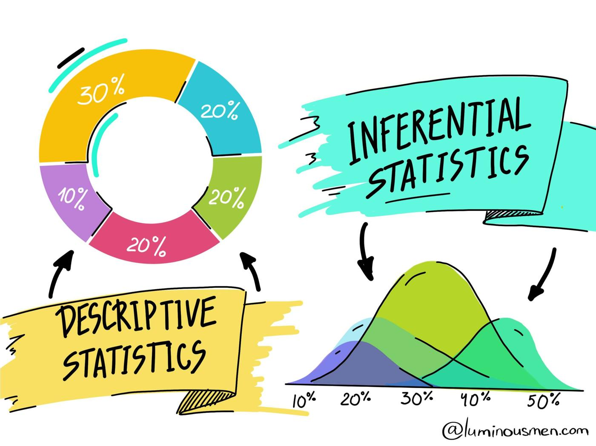
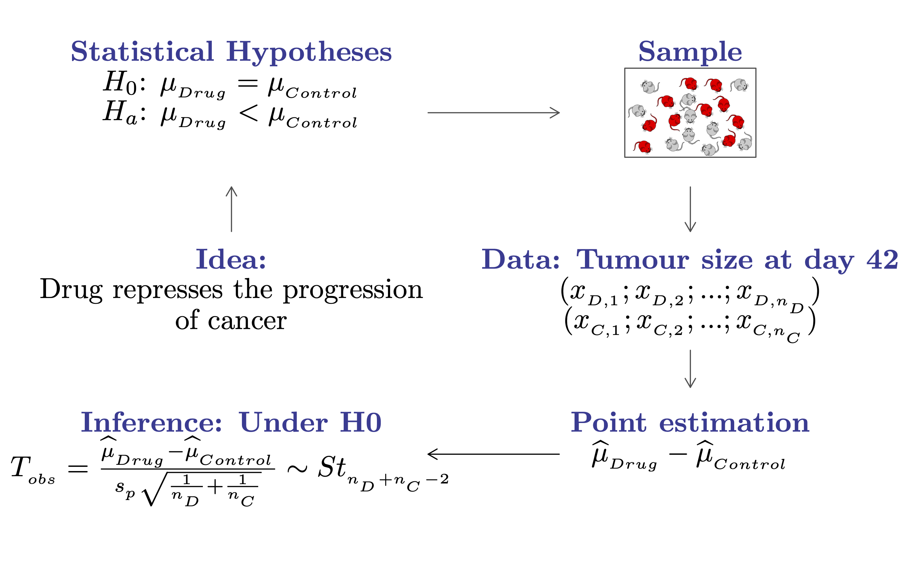
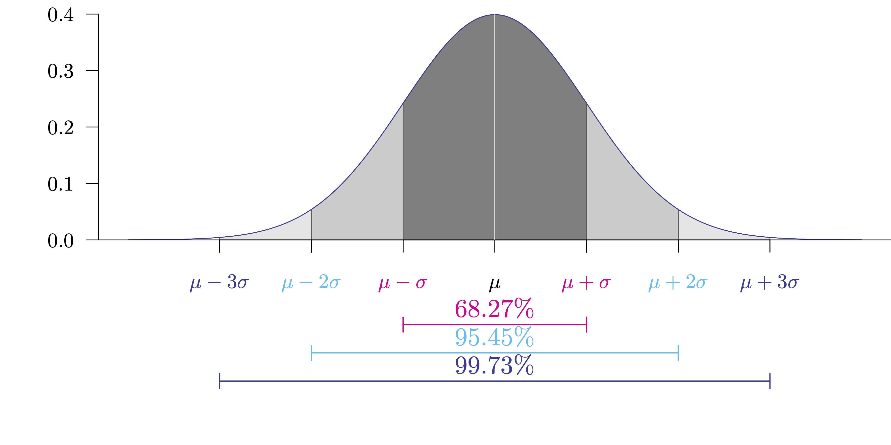
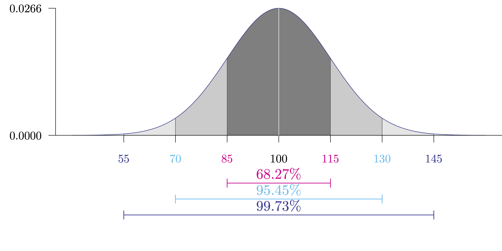
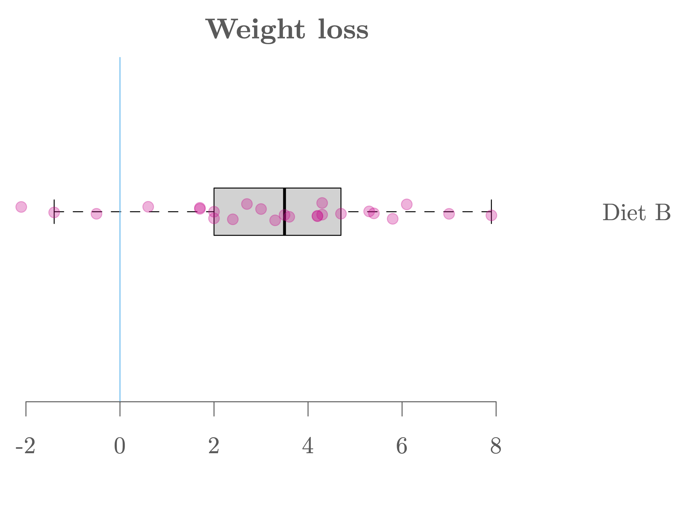
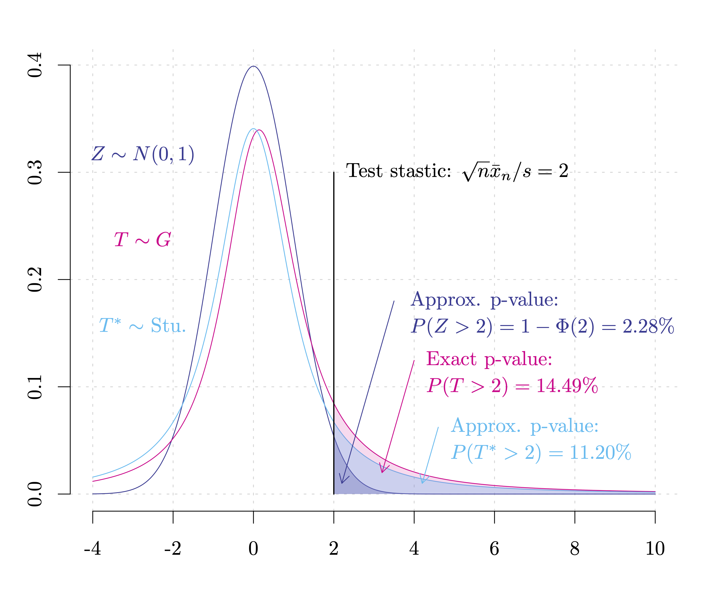

```{R, setup, include = F}
# devtools::install_github("dill/emoGG")
library(pacman)
p_load(
  broom, tidyverse,
  latex2exp, ggplot2, ggthemes, ggforce, viridis, extrafont, gridExtra,
  kableExtra, snakecase, janitor,
  data.table, dplyr, estimatr,
  lubridate, knitr, parallel,
  lfe,
  here, magrittr
)
# Define pink color
red_pink <- "#e64173"
turquoise <- "#20B2AA"
orange <- "#FFA500"
red <- "#fb6107"
blue <- "#2b59c3"
green <- "#8bb174"
grey_light <- "grey70"
grey_mid <- "grey50"
grey_dark <- "grey20"
purple <- "#6A5ACD"
slate <- "#314f4f"
# Dark slate grey: #314f4f
# Knitr options
opts_chunk$set(
  comment = "#>",
  fig.align = "center",
  fig.height = 7,
  fig.width = 10.5,
  warning = F,
  message = F
)
opts_chunk$set(dev = "svg")
options(device = function(file, width, height) {
  svg(tempfile(), width = width, height = height)
})
options(crayon.enabled = F)
options(knitr.table.format = "html")
# A blank theme for ggplot
theme_empty <- theme_bw() + theme(
  line = element_blank(),
  rect = element_blank(),
  strip.text = element_blank(),
  axis.text = element_blank(),
  plot.title = element_blank(),
  axis.title = element_blank(),
  plot.margin = structure(c(0, 0, -0.5, -1), unit = "lines", valid.unit = 3L, class = "unit"),
  legend.position = "none"
)
theme_simple <- theme_bw() + theme(
  line = element_blank(),
  panel.grid = element_blank(),
  rect = element_blank(),
  strip.text = element_blank(),
  axis.text.x = element_text(size = 18, family = "STIXGeneral"),
  axis.text.y = element_blank(),
  axis.ticks = element_blank(),
  plot.title = element_blank(),
  axis.title = element_blank(),
  # plot.margin = structure(c(0, 0, -1, -1), unit = "lines", valid.unit = 3L, class = "unit"),
  legend.position = "none"
)
theme_axes_math <- theme_void() + theme(
  text = element_text(family = "MathJax_Math"),
  axis.title = element_text(size = 22),
  axis.title.x = element_text(hjust = .95, margin = margin(0.15, 0, 0, 0, unit = "lines")),
  axis.title.y = element_text(vjust = .95, margin = margin(0, 0.15, 0, 0, unit = "lines")),
  axis.line = element_line(
    color = "grey70",
    size = 0.25,
    arrow = arrow(angle = 30, length = unit(0.15, "inches")
  )),
  plot.margin = structure(c(1, 0, 1, 0), unit = "lines", valid.unit = 3L, class = "unit"),
  legend.position = "none"
)
theme_axes_serif <- theme_void() + theme(
  text = element_text(family = "MathJax_Main"),
  axis.title = element_text(size = 22),
  axis.title.x = element_text(hjust = .95, margin = margin(0.15, 0, 0, 0, unit = "lines")),
  axis.title.y = element_text(vjust = .95, margin = margin(0, 0.15, 0, 0, unit = "lines")),
  axis.line = element_line(
    color = "grey70",
    size = 0.25,
    arrow = arrow(angle = 30, length = unit(0.15, "inches")
  )),
  plot.margin = structure(c(1, 0, 1, 0), unit = "lines", valid.unit = 3L, class = "unit"),
  legend.position = "none"
)
theme_axes <- theme_void() + theme(
  text = element_text(family = "Fira Sans Book"),
  axis.title = element_text(size = 18),
  axis.title.x = element_text(hjust = .95, margin = margin(0.15, 0, 0, 0, unit = "lines")),
  axis.title.y = element_text(vjust = .95, margin = margin(0, 0.15, 0, 0, unit = "lines")),
  axis.line = element_line(
    color = grey_light,
    size = 0.25,
    arrow = arrow(angle = 30, length = unit(0.15, "inches")
  )),
  plot.margin = structure(c(1, 0, 1, 0), unit = "lines", valid.unit = 3L, class = "unit"),
  legend.position = "none"
)
theme_set(theme_gray(base_size = 20))
# Column names for regression results
reg_columns <- c("Term", "Est.", "S.E.", "t stat.", "p-Value")
# Function for formatting p values
format_pvi <- function(pv) {
  return(ifelse(
    pv < 0.0001,
    "<0.0001",
    round(pv, 4) %>% format(scientific = F)
  ))
}
format_pv <- function(pvs) lapply(X = pvs, FUN = format_pvi) %>% unlist()
# Tidy regression results table
tidy_table <- function(x, terms, highlight_row = 1, highlight_color = "black", highlight_bold = T, digits = c(NA, 3, 3, 2, 5), title = NULL) {
  x %>%
    tidy() %>%
    select(1:5) %>%
    mutate(
      term = terms,
      p.value = p.value %>% format_pv()
    ) %>%
    kable(
      col.names = reg_columns,
      escape = F,
      digits = digits,
      caption = title
    ) %>%
    kable_styling(font_size = 20) %>%
    row_spec(1:nrow(tidy(x)), background = "white") %>%
    row_spec(highlight_row, bold = highlight_bold, color = highlight_color)
}
```

```{css, echo = F, eval = F}
@media print {
  .has-continuation {
    display: block !important;
  }
}
```

```{r xaringan-tile-view, echo=FALSE}
xaringanExtra::use_tile_view()
xaringanExtra::use_panelset()
xaringanExtra::use_clipboard()
xaringanExtra::use_extra_styles()
```


class: title-slide  
<div class="my-logo-right"></div>
<br>
<br>
<br>
<br>
 
# Introduction to Data Analytics

## Part I: Introduction to Statistical Inference

### .smaller[Stéphane Guerrier, Data Analytics Lab, University of Geneva 🇨🇭]
### .smaller[Dominique-L. Couturier, Cancer Research UK, University of Cambridge 🇬🇧]
### .smaller[Yuming Zhang, Data Analytics Lab, University of Geneva 🇨🇭]

<br>
```{R, out.width = "25%", echo = F}

```
.center[.tiny[License: [CC BY NC SA 4.0](https://creativecommons.org/licenses/by-nc-sa/4.0/)]]

### .tiny[This document was prepared with the help of Lionel Voirol, Wenfei Chu and Jun Wu.]
---

# R and RStudio

.pull-left[
In this class, we will use the statistical software .hi-purple[R] together with the integrated development environment .hi-purple[RStudio], which can be downloaded with the following: 

- Latest version of R: [https://cran.r-project.org/](https://cran.r-project.org/)
- Latest version of RStudio: [https://www.rstudio.com/](https://www.rstudio.com/)

.hi-purple[Note:] You cannot use RStudio without having installed R on your computer.
]


.pull-right[

```{R, out.width = "100%", echo = F}
include_graphics("pics/r_first_then.png")
```

.tiny[Source: [allisonhorst](https://github.com/allisonhorst/stats-illustrations)]
]

---

# R package idar

We have developed an `R` package for this class which is called `idar` (which stands for Introduction to Data Analytics with R) and that you can install by running the following code in your `R` console:

```R
install.packages("devtools")
devtools::install_github("https://github.com/SMAC-Group/idar", force = TRUE)
```

.hi-purple[Note:] Find the GitHub repository of the package [here](https://github.com/SMAC-Group/idar).

---

# What is statistics?

.pull-left[
.smaller[.hi-purple[Statistics] is a science that uses mathematics and computer science to deal with the collection, analysis, interpretation, and presentation of masses of numerical data. Informally, it is the .pink[science of learning from data].]
```{R, stat, out.width = "90%", echo = F}

```
.tiny[Source: [luminousmen](luminousmen.com)]
]

.pull-right[
.smaller[.hi-purple[Statistics] is a crucial part of our life. However, .pink[statistical methods are often consciously (or not) misused]. This can lead to contradictory studies and conclusions (as seen during the current COVID-19 pandemic).]

```{R, torture, out.width = "85%", echo = F}
include_graphics("pics/data-torture.png")
```

.tiny[Source: [Atoz Markets](https://atozmarkets.com/news/untold-reality-of-p-hacking-in-finance/)]
]

---

# How can statistics be useful?

.smaller[Statistics can be used (among others) to

1. .pink[Visualize data] (e.g. propagation of COVID-19 in different countries).
2. .pink[Understand and interpret data] (e.g. main causes of cancer). 
3. .pink[Assess the validity of a hypothesis] (e.g. is a drug working?).
4. .pink[Make predictions] (e.g. predicting unemployment or risk indices).]

.smaller[Learning more about statistics allows to 

1. Better understand arguments based on data.
2. Be able to apply critical thinking about statistics used as evidence.
3. Understand how statistical associations are used to evaluate claims (hypotheses) and assess causal connections.] 

.smaller[.purple[Understanding and knowing how to interpret statistical analyses is therefore becoming an increasingly vital skill.]]

---


# How to test a (scientific) hypothesis?

.center[
.purple["In god we trust, all others must bring data." <sup>.smallest[👋]</sup>]
]


- .smallest[To assess the .pink[validity of a (scientific) hypothesis], the scientific community (generally) agrees on a specific procedure.]
- .smallest[These hypotheses can be .pink[nearly anything], such as:]
  1. .smallest[Coffee consumption increases blood pressure. ]
  2. .smallest[Republican politicians are bad/good for the American Economy.]
  3. .smallest[A glass of red wine is as good as an hour at the gym.️]
- .smallest[This procedure involves the design of an experiment and then the collection of data to compute a metric, called .hi.purple[p-value], which evaluates the adequacy between the data and your original hypothesis.]
- .smallest[There is generally .pink[a specific threshold] (typically 5%), and if the p-value falls below this threshold we can claim that we have statistically significant result(s) validating our hypothesis.]

.footnote[.smallest[👋 From W. Edwards Deming.]]

---

# Statistics vs Truth 🤥

- .smallest[.pink[Statistically significant results are not necessarily the truth], as there isn't a threshold (e.g. 5%) that separates real results from the false ones.]
- .smallest[This procedure simply provides us with one piece of a puzzle that should be considered in the context of other evidence.]

```{R, out.width = "50%", echo = F}
include_graphics("pics/medical_studies.png")
```

.footnote[.smallest[👋] Read the original article: "*This is why you shouldn't believe that exciting new medical study*" [here](https://www.vox.com/2015/3/23/8264355/research-study-hype).]

---

# How does it work?

.smallest[
- Statistical methods are based on several fundamental concepts, the most central of which is to consider the information available (in the form of data) resulting from a .pink[random process].
- As such, the data represent a .hi-purple[random sample] of a totally or conceptually accessible .hi-purple[population].
- Then, .pink[statistical inference] allows to infer the properties of a population based on the observed sample. This includes deriving estimates and testing hypotheses.
]

```{R, out.width = "45%", echo = F}
include_graphics("pics/sampling.png")
```
.tiny[Source: [luminousmen](luminousmen.com)]

---

# Hypothesis testing

- In general (scientific) hypotheses can be translated into a set of (non-overlapping idealized) statistical hypotheses:

$$H_0: \theta \color{#eb078e}{\in} \Theta_0 \  \text{ and } \ H_a: \theta \color{#eb078e}{\not\in} \Theta_0.$$

- In a hypothesis test, the statement being tested is called the .hi-purple[null hypothesis] $\color{#373895}{H_0}$. A hypothesis test is designed to assess the strength of the evidence against the null hypothesis.
- The .hi-purple[alternative hypothesis] $\color{#373895}{H_a}$ is the statement we hope or suspect to be true instead of $\color{#373895}{H_0}$.
- Each hypothesis excludes the other, so that one can exclude one in favor of the other using the data.
- .pink[Example:] a drug represses the progression of cancer

$$H_0: \mu_{\text{drug}} \color{#eb078e}{=} \mu_{\text{control}} \  \text{ and } \ H_a: \mu_{\text{drug}}  \color{#eb078e}{<} \mu_{\text{control}}.$$
---

# Hypothesis testing


```{R, out.width = "100%", echo = F}

```

---

# Hypothesis testing


.smallest[
|                     | $H_0$ is true                               | $H_0$ is false                          |
| ------------------- |---------------------------------------------| ----------------------------------------|
| Can't reject $H_0$  | $\text{Correct decision (prob=}1-\alpha)$   | $\text{Type II error (prob=}1-\beta)$   |
| Reject $H_0$        | $\text{Type I error (prob}=\alpha)$         | $\text{Correct decision (prob=}\beta)$  |
]

- The .pink[type I error] corresponds to the probability of rejecting $H_0$ when $H_0$ is true (also called .pink[false positive]). The .purple[type II error] corresponds to the probability of not rejecting $H_0$ when $H_a$ is true (also called .purple[false negative]).
- A test is of .pink[significance level] $\color{#e64173}{\alpha}$ when the probability of making a type I error equals $\alpha$. Usually we consider $\alpha = 5\%$, however, this can vary depending on the context.
- A test is of .purple[power] $\color{#6A5ACD}{\beta}$ when the probability to make a type II error is $1-\beta.$ In other words, the power of a test is its probability of rejecting $H_0$ when $H_0$ is false (or the probability of accepting $H_a$ when $H_a$ is true).

---

# What are p-values?

- .smallest[The .hi-purple[p-value] is defined as the probability of observing a test statistic that is at least as extreme as actually observed, assuming that] $\small H_0$ .smallest[is true.]
- .smallest[Informally, .pink[a p-value can be understood as a measure of plausibility of the null hypothesis given the data]. Small p-value indicates strong evidence against] $\small H_0$.
- .smallest[When the p-value is small enough (i.e. smaller than the significance level] $\small \alpha$.smallest[), one says that the test based on the null and alternative hypotheses is .pink[significant] or that the null hypothesis is rejected in favor of the alternative. This is generally what we want because it "verifies" our (research) hypothesis.]
- .smallest[When the p-value is not small enough, with the available data, we cannot reject the null hypothesis so nothing can be concluded.] 🤔
- .smallest[The obtained p-value summarizes somehow the .pink[incompatibility between the data and the model] constructed under the set of assumptions.]

.center[
.smaller.purple["Absence of evidence is not evidence of absence."] <sup>.smallest[👋]</sup>]


.footnote[.smallest[👋] From the British Medical Journal.]

---

# How to understand p-values?

```{R, out.width = "45%", echo = F}
include_graphics("pics/p_value.png")
```

👋 .smallest[If you want to know more have a look [here](https://xkcd.com/1478/).]

---

# P-values may be controversial

.pink[P-values have been misused] many times because understanding what they mean is not intuitive!

<div align="center">
<iframe src="https://fivethirtyeight.abcnews.go.com/video/embed/56150342" width="675" height="380" scrolling="no" style="border:none;" allowfullscreen></iframe>
</div> 

👋 .smallest[If you want to know more have a look [here](https://fivethirtyeight.com/features/statisticians-found-one-thing-they-can-agree-on-its-time-to-stop-misusing-p-values/).]

---

# Quick review: Normal distribution

.smaller[$$Y\sim \mathcal{N}(\mu,\sigma^{2}), \ \ \ \ \ \color{#b4b4b4}{f_{Y}(y) = \frac{1}{\sqrt{2\pi{\color{drawColor6} \sigma}^{2}}}\ e^{-\frac{(y-{\color{drawColor6} \mu})^{2}}{2{\color{drawColor6} \sigma}^{2}}}}$$]

.smaller[$$\mathbb{E}[Y] = \mu, \ \ \ \ \ \text{Var}[Y] = \sigma^{2},$$]

.smaller[$$Z = \frac{Y-\mu}{\sigma} \sim \mathcal{N}(0,1), \ \ \ \ \ \color{#b4b4b4}{f_{Z}(z) = \frac{1}{\sqrt{2\pi}}\ e^{-\frac{z^{2}}{2}}.}$$]

.smaller[.purple[Probability density function of a normal distribution:]]

```{R, normal, out.width = "75%", echo = F}

```

---

# Quick review: Normal distribution

.smaller[$$Y\sim \mathcal{N}(\mu,\sigma^{2}), \ \ \ \ \ \color{#b4b4b4}{f_{Y}(y) = \frac{1}{\sqrt{2\pi{\color{drawColor6} \sigma}^{2}}}\ e^{-\frac{(y-{\color{drawColor6} \mu})^{2}}{2{\color{drawColor6} \sigma}^{2}}}}$$]

.smaller[$$\mathbb{E}[Y] = \mu, \ \ \ \ \ \text{Var}[Y] = \sigma^{2},$$]

.smaller[$$Z = \frac{Y-\mu}{\sigma} \sim \mathcal{N}(0,1), \ \ \ \ \ \color{#b4b4b4}{f_{Z}(z) = \frac{1}{\sqrt{2\pi}}\ e^{-\frac{z^{2}}{2}}.}$$]

.smaller[.purple[Suitable modeling for a lot of phenomena: IQ]] $\small \color{#373895}{\sim \mathcal{N}(100,15^{2})}$

```{R, normal2, out.width = "75%", echo = F}

```

---

# .smaller[Normal distribution as an approximation?]

The .hi.purple[Central Limit Theorem(s) (CLT)] states (very informally): .purple[*the sampling distribution of the average of independent (or "not too strongly dependent") random variables (whose distributions are "not too different" nor "too extreme") tends to a normal distribution as the sample size gets larger.*]

As an example, one of the simplest version of the CLT (known as the *Lindeberg–Lévy CLT*) states:
*Suppose that* $\{X_{1},\ldots ,X_{n}\}$ *is a sequence of* *iid* *random variables such that* $\mathbb{E}[ X_i ] = \mu$ *and $\text{Var} [X_{i}]=\sigma^{2}<\infty$. Let ${\bar{X}}_{n} = \frac{1}{n} \sum_{i = 1}^n X_i$, then as $n$ approaches infinity, the random variables $\sqrt{n} (\bar{X}_{n}-\mu)$ .pink[converge in distribution] to a normal $\mathcal{N}(0,\sigma^{2})$.*

This result can be extended (under some conditions) to .pink[dependent] (i.e. $X_i$ and $X_j$ are not independent for $i \neq j$) and/or .pink[non identically distributed] (i.e. $X_i$ and $X_j$ don't have the same distribution for $i \neq j$) data.

---

# .smaller[Normal distribution as an approximation?]

Loosely speaking, we can translate the results of CLTs as 

$$\bar{X}_n = \frac{1}{n} \sum_{i = 1}^n X_i \color{#eb078e}{\overset{\cdot}{\sim}} {\mathcal{N}\left(\mu, \frac{\sigma^2}{n}\right)},$$ 

where $\color{#eb078e}{\overset{\cdot}{\sim}}$ corresponds ".pink[approximately distributed as]". This result is essential in statistics and a vast majority of inferential methods are based on some versions of the CLT.

Informally, it means that when a measurement can be thought of as the average (or the sum) of .hi.purple[numerous factors], its distribution tends to go to a normal distribution. For example, the height of adults can be thought of as the sum of their genetic information, diet, life style, ...

---

# .smaller[Central Limit Theorem - Example]

.smaller[People have used .pink[the Galton Board] as a practical device to demonstrate the CLT, in particular that with sufficient sample size the binomial distribution approximates a normal distribution.]

<div align="center">
<iframe width="684" height="381" src="https://www.youtube.com/embed/Vo9Esp1yaC8" frameborder="0" allow="accelerometer; autoplay; encrypted-media; gyroscope; picture-in-picture" allowfullscreen></iframe>
</div>

---

# .smaller[Normal distribution in nature?]

> .smaller[Amends might be made in the interest of the new generation of students by printing in leaded type in future editions of existing text-books and in all new text-books:]
>
> *.smaller[.pink[Normality is a myth; there never was, and never will be, a normal distribution.]]* 😟 

.smallest[👋].smallest[*[ Testing for normality](https://www.jstor.org/stable/2332434?seq=1#metadata_info_tab_contents)*, R.C. Geary, Biometrika, 1947]

<br>

> .smaller[.pink[All models are wrong, but some are useful.]] 🧐

.smallest[👋].smallest[*[ Science and Statistics](http://www-sop.inria.fr/members/Ian.Jermyn/philosophy/writings/Boxonmaths.pdf)*, G. Box, Journal of the American Statistical Association, 1976]

---

# So how does it work?

Suppose that we conduct an experiment on $n$ patients where a new diet is tested. We measure $X_i$ as the weight loss after 4 months. Our hope is to show that the diet allows to significantly reduce the weight of the participants.

Suppose that the (possibly dependent) data are such that $X_i \sim F_{\color{#eb078e}{i}}, \, i = 1,\ldots, n$ and $\mathbb{E}[X_i] = \mu$. This is a rather plausible assumption (why? 🤔). To verify our hypothesis (i.e. diet reduces weight) we consider:

$$H_0: \mu \color{#eb078e}{=} 0 \ \ \ \ \text{and} \ \ \ \ H_a: \mu \color{#eb078e}{>} 0.$$

This implies that we are considering the following model:

$$X_i = \mu + \color{#373895}{\varepsilon_i},$$
where $\color{#373895}{\varepsilon_i} = X_i - \mu$ can be understood as ".purple[residuals]".

---

# So how does it work?

Then, by the CLT we have

$$T = \frac{\sqrt{n} \left(\bar{X}_n - \mu_{H_0}\right)}{\color{#373895}{S}} = \frac{\sqrt{n}\bar{X}_n}{\color{#373895}{S}} \color{#eb078e}{\underset{H_0}{\sim}} G \color{#eb078e}{\to} \mathcal{N}(0,1),$$
where $\color{#373895}{S} = \sqrt{ \frac{1}{n-1} \sum_{i = 1}^n (X_i - \bar{X}_n)^2}$ and $\color{#eb078e}{\underset{H_0}{\sim}}$ corresponds ".pink[distributed under] $\color{#eb078e}{H_0}$ .pink[as]". In the above formula $T$ is a random variable but we can compute its .hi-purple[realization] based on our sample, i.e. $\color{#eb078e}{\sqrt{n}\bar{x}_n/s}$.

Let $Z \sim \mathcal{N}(0,1)$, then using the definition of the p-value<sup>.smallest[👋]</sup>, we have

$$\text{p-value} = \Pr \left(T > \frac{\sqrt{n}\bar{x}_n}{s} \right) \color{#eb078e}{\overset{\tiny CLT}{\approx}} \Pr \left(Z > \frac{\sqrt{n}\bar{x}_n}{s} \right) = 1 - \Phi\left(\frac{\sqrt{n}\bar{x}_n}{s}\right).$$

.footnote[.smallest[👋] Reminder: the .hi-purple[p-value] is defined as the probability of observing a test statistic that is at least as extreme as actually observed, assuming that the null hypothesis is true.]

---

# So how does it work?

```{R, pvalue, out.width = "80%", echo = F}
include_graphics("pics/pvalue.png")
```

---

# Diet Example

.panelset[
.panel[.panel-name[Graph]
```{R, dietB, out.width = "80%", echo = F}

```
]
.panel[.panel-name[Import]
```{r xaringan-extra-styles}
# install.packages("devtools")
# devtools::install_github("https://github.com/SMAC-Group/idar")

# Import data
library(idar) 
data(diet)

# Compute weight loss
diet$weight.loss = diet$initial.weight - diet$final.weight

# Select diet
posw = diet$diet.type=="B"

# Variable of interest
X = diet$weight.loss[posw]

# A first look...
head(X)
```
]
.panel[.panel-name[P-value]

```{r}
# Sample size
n = length(X)

# Compute mean
Xbar = mean(X)

# Compute s
s = sd(X)

# Compute test statistic
t = sqrt(n)*Xbar/s

# Approx. p-value
(p_value = 1 - pnorm(t))
```

.smallest[This result suggests that Diet B allows to reduce the weight of the participants.]
]
.panel[.panel-name[Description]
We consider an experiment on 76 people using one of the three diets, labeled as Diet A, B, and C. We are interested in knowing .pink[whether Diet B allows to reduce the weight of the participants]. To test our hypothesis, we collected a dataset that contains information on the participants, including their gender, age, height, assigned types of diets, initial weight and final weight after the experiment.

Source: [University of Sheffield](https://www.sheffield.ac.uk/mash/statistics/datasets)
]

]

---

# One-sample Student's t-test

Before we assume that the (possibly correlated) data is such that $X_i \sim F_{\color{#eb078e}{i}}, \, i = 1,\ldots, n$ and $\mathbb{E}[X_i] = \mu$. However, in the .pink[very special] case where

$$X_i \color{#eb078e}{\overset{iid}{\sim}} \mathcal{N}(\mu, \sigma^2),$$
which corresponds to the following model:

$$X_i = \mu + \color{#373895}{\varepsilon_i},$$
with $\color{#373895}{\varepsilon_i} = X_i - \mu \color{#eb078e}{\overset{iid}{\sim}} \mathcal{N}(0,\sigma^2)$, we have

$$T = \frac{\sqrt{n} \left(\bar{X}_n - \mu_{H_0}\right)}{\color{#373895}{S}} = \frac{\sqrt{n}\bar{X}_n}{\color{#373895}{S}} \color{#eb078e}{\underset{H_0}{\overset{}{\sim}}} \text{Student}(n-1) \color{#eb078e}{\overset{}{\to}} \mathcal{N}(0,1).$$
Unlike our previous result, $T$ .pink[follows exactly] a $\text{Student}(n-1)$ distribution for all $n$. 📝 $\text{Student}(n) \color{#eb078e}{\overset{}{\to}} \mathcal{N}(0,1)$ as $n \color{#eb078e}{\overset{}{\to}} \infty$.

---

# Remarks

- .smaller[.pink[Why is it called Student?] The Student's t distributions were discovered in 1908 by William S. Gosset, who is a statistician employed by the Guinness brewing company. Gosset devised the t-test as an economical way to monitor the quality of stout 🍻. The company forbade its scientists from publishing their findings, so Gosset published his statistical work under the pen name ".pink[Student]".]

- .smaller[The t-test (similarly to the test previously discussed) can be used to test if the population mean is .pink[greater, smaller, or different than] a hypothesized value, i.e.] 

$$H_0: \mu \color{#eb078e}{=} \mu_0 \ \ \ \ \text{and} \ \ \ \ H_a: \mu \ \big[ \color{#eb078e}{>} \text{ or } \color{#eb078e}{<} \text{ or } \color{#eb078e}{\neq} \big] \ \mu_0.$$

- .smaller[The t-test accounts for the uncertainty of sample variance and we have:] 

$$\text{p-values based on } \mathcal{N} (0, 1)\color{#eb078e}{<}\text{p-values based on } \text{Student}(n).$$
---

# Remarks

```{R, pvalue2, out.width = "80%", echo = F}

```


---

# R syntax for the t-test

In `R`, we can use the function `t.test(...)` to compute the p-value for the one-sample Student's t-test. For more information, have a look at `?t.test`. Here are some examples with different alternative hypotheses:

$$H_0: \mu \color{#eb078e}{=} 5 \ \ \ \ \text{and} \ \ \ \ H_a: \mu \color{#eb078e}{>} 5$$
```{r, eval = FALSE}
t.test(data, alternative = "greater", mu = 5)
```

$$H_0: \mu \color{#eb078e}{=} 0 \ \ \ \ \text{and} \ \ \ \ H_a: \mu \color{#eb078e}{<} 0$$
```{r, eval = FALSE}
t.test(data, alternative = "less", mu = 0)
t.test(data, alternative = "less")
```

$$H_0: \mu \color{#eb078e}{=} 0 \ \ \ \ \text{and} \ \ \ \ H_a: \mu \color{#eb078e}{\neq} 0$$
```{r, eval = FALSE}
t.test(data, alternative = "two.sided", mu = 0)
t.test(data)
```

---

# Diet Example (with t-test)

.panelset[
.panel[.panel-name[Results]
1. .purple[Define hypotheses:] $H_0: \mu = 0$ and $H_a: \mu \color{#e64173}{>} 0$.
2. .purple[Define] $\color{#373895}{\alpha}$: We consider $\alpha = 5\%$.
3. .purple[Compute p-value]: p-value =  $3.697 \times 10^{-5} \ \%$ (see R output tab for details).
4. .purple[Conclusion:] We have p-value < $\alpha$ and so we can reject the null hypothesis at the significance level of 5% and conclude that the diet significantly reduces the weight of the participants.
]
.panel[.panel-name[`R` output]
```{r}
t.test(X, alternative = "greater")
```

.smallest[As expected the p-value of this test is larger than the one of the previous test (based on the CLT).]
]]

---

# Limitations of the one-sample t-test

The .pink[reliability] of the t-test strongly relies on: 

1. The absence of .pink[outliers];
2. For moderate and small sample, the sample distribution is at least .pink[approximately normal] with no strong skewness (i.e. heavy tails). <sup>.smallest[✋]</sup>

⚠️ Therefore, before proceeding to any inference, we should check the data preliminarily using .purple[boxplot] or .purple[histogram] or .purple[QQ plot] <sup>.smallest[👋]</sup> to see if a t-test can be used.

In the diet example, these assumptions appear plausible. When this is not the case, the .pink[Wilcoxon signed rank test] can be used as an alternative that is less sensitive to outliers and doesn't assume that the data are normally distributed. This test is, however, less powerful than the t-test (when its assumptions are satisfied).

.footnote[✋ If you want to know more [here](https://www.annualreviews.org/doi/full/10.1146/annurev.publhealth.23.100901.140546) is an interesting reference. 👋 Check out [QQ plot](https://en.wikipedia.org/wiki/Q%E2%80%93Q_plot).]

---

# One-sample Wilcoxon signed rank test

- .smaller[The .pink[rank] is the position index of each observation when we order them from smallest to largest, starting with rank 1 for the smallest observation.]
- .smaller[The Wilcoxon signed rank test only uses the ranks (i.e. the ordering) of the observations, and makes no use of their actual numerical values. Therefore, it is a .pink[nonparametric test].]
- .smaller[The Wilcoxon signed rank test depends on the .pink[Wilcoxon signed rank statistic], which is the sum of the ranks of only the positive values (or only the negative values). Its distribution under the null can be obtained by different methods (e.g. exact, asymptotic normal, ...) but the details are beyond the scope of this class.]
- .smaller[Unlike the t-test whose hypotheses are on the population mean, the Wilcoxon signed rank test states the hypotheses in terms of .pink[population median]. When the distribution is symmetric, the mean and the median of the population have the same value.]

---

# One-sample Wilcoxon signed rank test

- Under the assumption of a symmetric distribution, the assumed model for this method is given by $X_i = \mu + \color{#373895}{\varepsilon_i}$, where $\color{#373895}{\varepsilon_i} = X_i - \mu \color{#eb078e}{\overset{iid}{\sim}} (0,\sigma^2)$.

- The Wilcoxon signed rank test considers the same alternative hypothesis as the t-test and its use in `R` is based on the function `wilcox.test(...)`, which has a similar syntax as the function `t.test(...)`. 

- In general, assessing whether the data is normally distributed is .purple[very difficult]. (In fact, there is no satisfactory statistical method for it.)

- .pink[A reasonable strategy is to always use the one-sample Wilcoxon signed rank test]. Compared to the t-test, we may lose a bit of power using the Wilcoxon signed rank test if all the conditions are indeed satisfied (although the difference is generally very small), but if this is not the case the results will be far more reliable. 

---

# Diet Example (with Wilcoxon test)

.panelset[
.panel[.panel-name[Results]
1. .purple[Define hypotheses:] $H_0: \mu = 0$ and $H_a: \mu \color{#e64173}{>} 0$.
2. .purple[Define] $\color{#373895}{\alpha}$: We consider $\alpha = 5\%$.
3. .purple[Compute p-value]: p-value = $2.71 \times 10^{-3} \ \%$ (see R output tab for details).
4. .purple[Conclusion:] We have p-value < $\alpha$ and so we can reject the null hypothesis at the significance level of 5% and conclude that the diet significantly reduces the weight of the participants.
]
.panel[.panel-name[`R` output]
```{r}
wilcox.test(X, alternative = "greater")
```
]]
