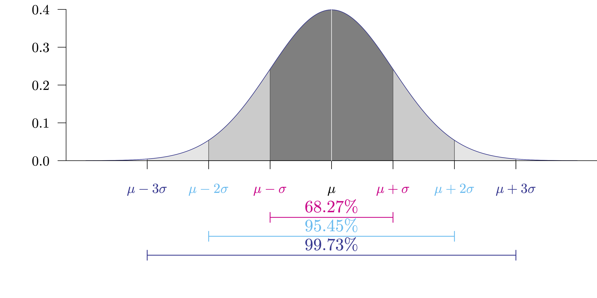
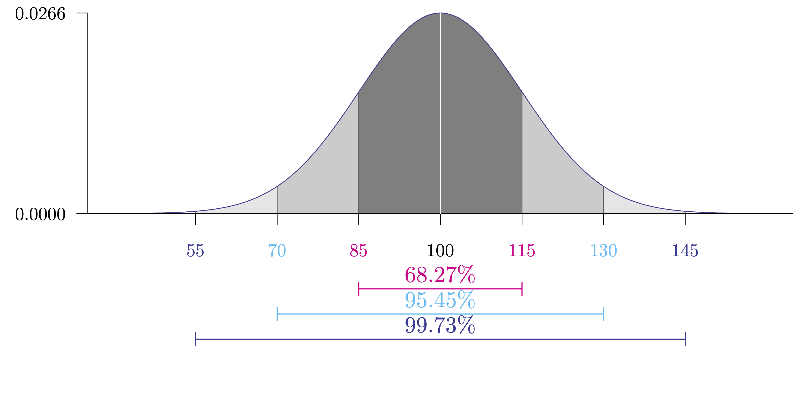
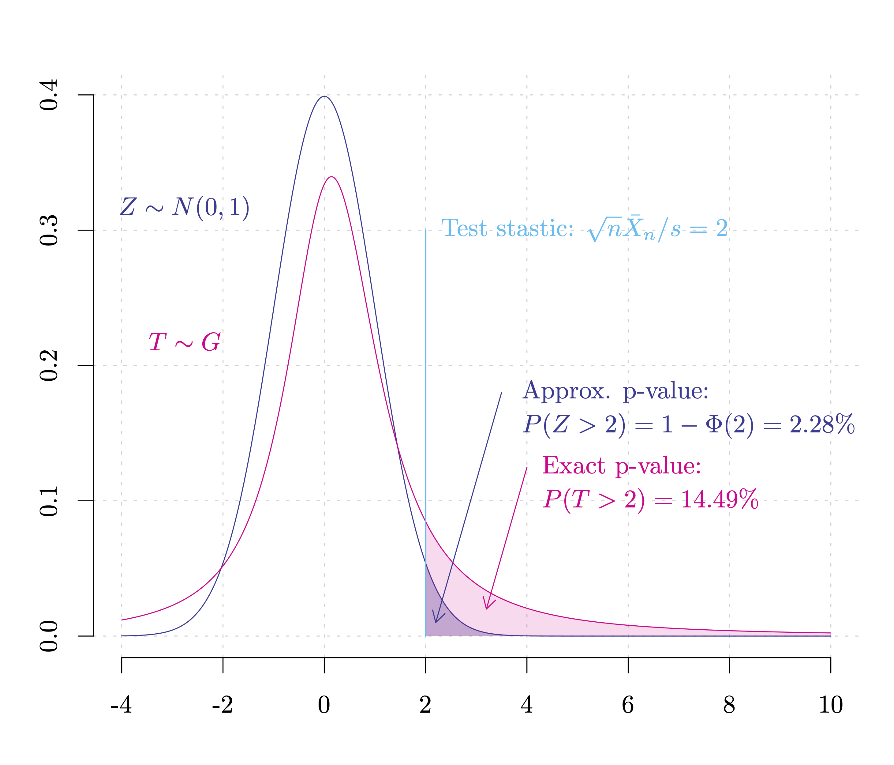
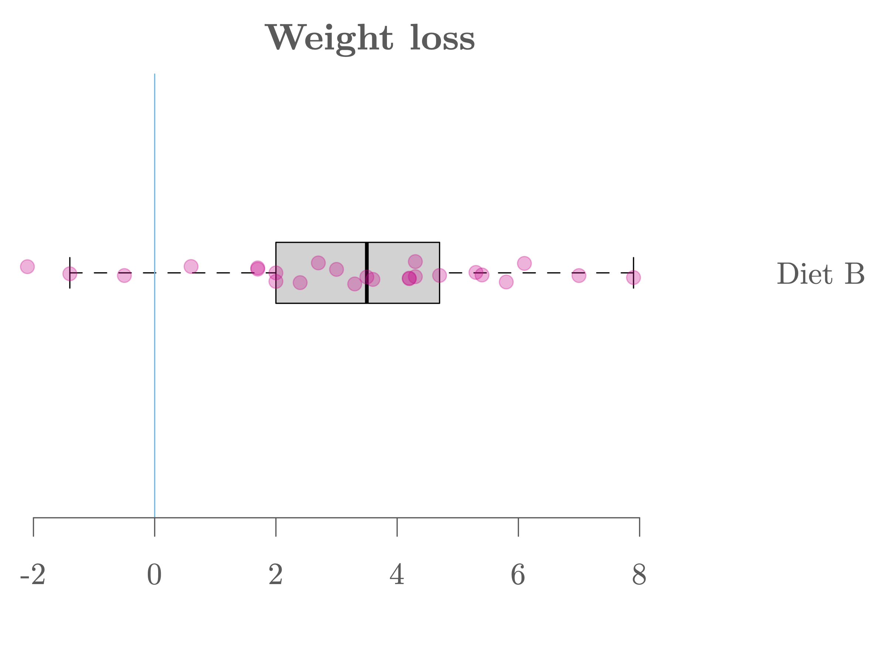

```{R, setup, include = F}
# devtools::install_github("dill/emoGG")
library(pacman)
p_load(
  broom, tidyverse,
  latex2exp, ggplot2, ggthemes, ggforce, viridis, extrafont, gridExtra,
  kableExtra, snakecase, janitor,
  data.table, dplyr, estimatr,
  lubridate, knitr, parallel,
  lfe,
  here, magrittr
)
# Define pink color
red_pink <- "#e64173"
turquoise <- "#20B2AA"
orange <- "#FFA500"
red <- "#fb6107"
blue <- "#2b59c3"
green <- "#8bb174"
grey_light <- "grey70"
grey_mid <- "grey50"
grey_dark <- "grey20"
purple <- "#6A5ACD"
slate <- "#314f4f"
# Dark slate grey: #314f4f
# Knitr options
opts_chunk$set(
  comment = "#>",
  fig.align = "center",
  fig.height = 7,
  fig.width = 10.5,
  warning = F,
  message = F
)
opts_chunk$set(dev = "svg")
options(device = function(file, width, height) {
  svg(tempfile(), width = width, height = height)
})
options(crayon.enabled = F)
options(knitr.table.format = "html")
# A blank theme for ggplot
theme_empty <- theme_bw() + theme(
  line = element_blank(),
  rect = element_blank(),
  strip.text = element_blank(),
  axis.text = element_blank(),
  plot.title = element_blank(),
  axis.title = element_blank(),
  plot.margin = structure(c(0, 0, -0.5, -1), unit = "lines", valid.unit = 3L, class = "unit"),
  legend.position = "none"
)
theme_simple <- theme_bw() + theme(
  line = element_blank(),
  panel.grid = element_blank(),
  rect = element_blank(),
  strip.text = element_blank(),
  axis.text.x = element_text(size = 18, family = "STIXGeneral"),
  axis.text.y = element_blank(),
  axis.ticks = element_blank(),
  plot.title = element_blank(),
  axis.title = element_blank(),
  # plot.margin = structure(c(0, 0, -1, -1), unit = "lines", valid.unit = 3L, class = "unit"),
  legend.position = "none"
)
theme_axes_math <- theme_void() + theme(
  text = element_text(family = "MathJax_Math"),
  axis.title = element_text(size = 22),
  axis.title.x = element_text(hjust = .95, margin = margin(0.15, 0, 0, 0, unit = "lines")),
  axis.title.y = element_text(vjust = .95, margin = margin(0, 0.15, 0, 0, unit = "lines")),
  axis.line = element_line(
    color = "grey70",
    size = 0.25,
    arrow = arrow(angle = 30, length = unit(0.15, "inches")
  )),
  plot.margin = structure(c(1, 0, 1, 0), unit = "lines", valid.unit = 3L, class = "unit"),
  legend.position = "none"
)
theme_axes_serif <- theme_void() + theme(
  text = element_text(family = "MathJax_Main"),
  axis.title = element_text(size = 22),
  axis.title.x = element_text(hjust = .95, margin = margin(0.15, 0, 0, 0, unit = "lines")),
  axis.title.y = element_text(vjust = .95, margin = margin(0, 0.15, 0, 0, unit = "lines")),
  axis.line = element_line(
    color = "grey70",
    size = 0.25,
    arrow = arrow(angle = 30, length = unit(0.15, "inches")
  )),
  plot.margin = structure(c(1, 0, 1, 0), unit = "lines", valid.unit = 3L, class = "unit"),
  legend.position = "none"
)
theme_axes <- theme_void() + theme(
  text = element_text(family = "Fira Sans Book"),
  axis.title = element_text(size = 18),
  axis.title.x = element_text(hjust = .95, margin = margin(0.15, 0, 0, 0, unit = "lines")),
  axis.title.y = element_text(vjust = .95, margin = margin(0, 0.15, 0, 0, unit = "lines")),
  axis.line = element_line(
    color = grey_light,
    size = 0.25,
    arrow = arrow(angle = 30, length = unit(0.15, "inches")
  )),
  plot.margin = structure(c(1, 0, 1, 0), unit = "lines", valid.unit = 3L, class = "unit"),
  legend.position = "none"
)
theme_set(theme_gray(base_size = 20))
# Column names for regression results
reg_columns <- c("Term", "Est.", "S.E.", "t stat.", "p-Value")
# Function for formatting p values
format_pvi <- function(pv) {
  return(ifelse(
    pv < 0.0001,
    "<0.0001",
    round(pv, 4) %>% format(scientific = F)
  ))
}
format_pv <- function(pvs) lapply(X = pvs, FUN = format_pvi) %>% unlist()
# Tidy regression results table
tidy_table <- function(x, terms, highlight_row = 1, highlight_color = "black", highlight_bold = T, digits = c(NA, 3, 3, 2, 5), title = NULL) {
  x %>%
    tidy() %>%
    select(1:5) %>%
    mutate(
      term = terms,
      p.value = p.value %>% format_pv()
    ) %>%
    kable(
      col.names = reg_columns,
      escape = F,
      digits = digits,
      caption = title
    ) %>%
    kable_styling(font_size = 20) %>%
    row_spec(1:nrow(tidy(x)), background = "white") %>%
    row_spec(highlight_row, bold = highlight_bold, color = highlight_color)
}
```

```{css, echo = F, eval = F}
@media print {
  .has-continuation {
    display: block !important;
  }
}
```

```{r xaringan-tile-view, echo=FALSE}
xaringanExtra::use_tile_view()
xaringanExtra::use_panelset()
xaringanExtra::use_clipboard()
xaringanExtra::use_extra_styles()
```


class: title-slide  
<div class="my-logo-right"></div>
<br>
<br>
<br>
<br>
 
# Data Analytics for Pharmaceutical Sciences

## Part II: Analysis of Variance (ANOVA)

### .smaller[Stéphane Guerrier, Data Analytics Lab, University of Geneva, 🇨🇭]
### .smaller[Dominique-L. Couturier, Cancer Research UK, University of Cambridge, 🇬🇧]

<br>
<br>
```{R, out.width = "25%", echo = F}
include_graphics("pics/liscence.png")
```
.center[.tiny[License: [CC BY NC SA 4.0](https://creativecommons.org/licenses/by-nc-sa/4.0/)]]

### .tiny[This document was prepared with the help of Wenfei Chu & Yuming Zhang]
---


# Quick review: Normal distribution

.smaller[$$Y\sim \mathcal{N}(\mu,\sigma^{2}), \ \ \ \ \ \color{#b4b4b4}{f_{Y}(y) = \frac{1}{\sqrt{2\pi{\color{drawColor6} \sigma}^{2}}}\ e^{-\frac{(y-{\color{drawColor6} \mu})^{2}}{2{\color{drawColor6} \sigma}^{2}}}}$$]

.smaller[$$\mathbb{E}[Y] = \mu, \ \ \ \ \ \text{Var}[Y] = \sigma^{2},$$]

.smaller[$$Z = \frac{Y-\mu}{\sigma} \sim \mathcal{N}(0,1), \ \ \ \ \ \color{#b4b4b4}{f_{Z}(z) = \frac{1}{\sqrt{2\pi}}\ e^{-\frac{z^{2}}{2}}.}$$]

.smaller[.purple[Probability density function of a normal distribution:]]

```{R, normal, out.width = "75%", echo = F}

```

---

# Quick review: Normal distribution

.smaller[$$Y\sim \mathcal{N}(\mu,\sigma^{2}), \ \ \ \ \ \color{#b4b4b4}{f_{Y}(y) = \frac{1}{\sqrt{2\pi{\color{drawColor6} \sigma}^{2}}}\ e^{-\frac{(y-{\color{drawColor6} \mu})^{2}}{2{\color{drawColor6} \sigma}^{2}}}}$$]

.smaller[$$\mathbb{E}[Y] = \mu, \ \ \ \ \ \text{Var}[Y] = \sigma^{2},$$]

.smaller[$$Z = \frac{Y-\mu}{\sigma} \sim \mathcal{N}(0,1), \ \ \ \ \ \color{#b4b4b4}{f_{Z}(z) = \frac{1}{\sqrt{2\pi}}\ e^{-\frac{z^{2}}{2}}.}$$]

.smaller[.purple[Suitable modeling for a lot of phenomena: IQ]] $\small \color{#373895}{\sim \mathcal{N}(100,15^{2})}$

```{R, normal2, out.width = "75%", echo = F}

```

---

# .smaller[Normal distribution as an approximation?]

The .hi.purple[Central Limit Theorem(s) (CLT)] that states (very informally): .purple[*the sampling distribution of the average of independent (or "not too strongly correlated") random variables (whose distributions are "not too different" nor "too extreme") tends to a normal distribution as the sample size gets larger.*]

As an example, one of the simplest version of the CLT (known as the *Lindeberg–Lévy CLT*) states:
*Suppose that* $\{X_{1},\ldots ,X_{n}\}$ *is a sequence of* *iid* *random variables such that* $\mathbb{E}[ X_i ] = \mu$ *and $\text{Var} [X_{i}]=\sigma^{2}<\infty$. Let ${\bar{X}}_{n} = \frac{1}{n} \sum_{i = 1}^n X_i$, then as $n$ approaches infinity, the random variables $\sqrt{n} (\bar{X}_{n}-\mu)$ .pink[converge in distribution] to a normal $\mathcal{N}(0,\sigma^{2})$.*

This result can be extended (under some conditions) to .pink[dependent] (i.e. $X_i$ and $X_j$ are not independent for $i \neq j$) and/or .pink[non identically distributed] (i.e. $X_i$ and $X_j$ don't have the same distribution for $i \neq j$).

---

# .smaller[Normal distribution as an approximation?]

Loosely speaking, we can translate CLTs results as 

$$\bar{X}_n = \frac{1}{n} \sum_{i = 1}^n X_i \color{#eb078e}{\overset{\cdot}{\sim}} {\mathcal{N}(\mu, \sigma^2)},$$ 

where $\color{#eb078e}{\overset{\cdot}{\sim}}$ corresponds ".pink[approximately distributed as]". This result is essential in statistics and the vast majority of inferential methods are based on some version of the CLT.

Informally, it means that when a measurement can be thought of as the average (or the sum) of .hi.purple[numerous factors], its distribution tends to go to a normal distribution. For example, the height of adults can be thought of as the sum of their genetic information, diet, life style, ...

---

# .smaller[Normal distribution in nature?]

> .smaller[Amends might be made in the interest of the new generation of students by printing in leaded type in future editions of existing text-books and in all new text-books:]
>
> *.smaller[.pink[Normality is a myth; there never was, and never will be, a normal distribution.]]*

.smallest[👋].smallest[*[ Testing for normality](https://www.jstor.org/stable/2332434?seq=1#metadata_info_tab_contents)*, R.C. Geary, Biometrika, 1947]

<br>

> .smaller[.pink[All models are wrong, but some are useful.]]

.smallest[👋].smallest[*[ Science and Statistics](http://www-sop.inria.fr/members/Ian.Jermyn/philosophy/writings/Boxonmaths.pdf)*, G. Box, Journal of the American Statistical Association, 1976]

---

# So how does it work?

Suppose that we conduct an experiment on $n$ patients where a new diet is tested. We measure $X_i$ as the weight loss after 4 months. Our hope is to show that the diet allows to significantly reduce the weight of the participants.

Suppose that the (possibly dependent) data are such that $X_i \sim F_i, \, i = 1,\ldots, n$ and $\mathbb{E}[X_i] = \mu$. This is a rather a plausible assumption (why? 🤔). To verify our hypothesis (i.e. diet reduces weight) we consider:

$$H_0: \mu \color{#eb078e}{=} 0 \ \ \ \ \text{and} \ \ \ \ H_a: \mu \color{#eb078e}{>} 0.$$

This implies that we are considering the following model

$$X_i = \mu + \color{#373895}{\varepsilon_i},$$
where $\color{#373895}{\varepsilon_i} = X_i - \mu$ can be understood ".purple[residuals]".

---

# So how does it work?

Then, by the CLT we have

$$T = \frac{\sqrt{n} \left(\bar{X}_n - \mu_{H_0}\right)}{\color{#373895}{S}} = \frac{\sqrt{n}\bar{X}_n}{\color{#373895}{S}} \color{#eb078e}{\underset{H_0}{\overset{\cdot}{\sim}}} \mathcal{N}(0,1),$$
where $\color{#373895}{S} = \sqrt{ \frac{1}{n} \sum_{i = 1}^n (X_i - \bar{X}_n)^2}$ and $\color{#eb078e}{\underset{H_0}{\overset{\cdot}{\sim}}}$ corresponds ".pink[approximately distributed under] $\color{#eb078e}{H_0}$ .pink[as]". In the above formula $T \sim G \approx \mathcal{N}(0,1)$ is a random variable but we can compute its .hi-purple[realization] based on our sample, i.e. $\color{#eb078e}{\sqrt{n}\bar{x}_n/s}$.

Using the definition of the p-value<sup>.smallest[👋]</sup>, we have

$$\text{p-value} = \Pr \left(T > \frac{\bar{x}_n}{s} \right) \color{#eb078e}{\overset{\tiny CLT}{\approx}} \Pr \left(Z > \frac{\bar{x}_n}{s} \right) = 1 - \Phi\left(\frac{\bar{x}_n}{s}\right).$$

.footnote[.smallest[👋] The .hi-purple[p-value] is defined as the probability, assuming that the null is true, that the test statistic will take a value at least as extreme as that actually observed.]

---

# So how does it work?

```{R, pvalue, out.width = "80%", echo = F}

```

---

# Diet Example

YUMING COULD YOU DO THIS? 
(https://www.sheffield.ac.uk/polopoly_fs/1.570199!/file/stcp-Rdataset-Diet.csv)

---

# Diet Example

.panelset[
.panel[.panel-name[Graph]
```{R, dietB, out.width = "80%", echo = F}

```
]
.panel[.panel-name[Import]
```{r xaringan-extra-styles}
# Import data
diet = read.csv("data/diet.csv",row.names=1)

# Compute weight loss
diet$weight.loss = diet$initial.weight - diet$final.weight

# Select diet
posw = diet$diet.type=="B"

# Variable of interest
X = diet$weight.loss[posw]

# A first look...
head(X)
```
]
.panel[.panel-name[P-value]

```{r}
# Sample size
n = length(X)

# Compute mean
Xbar = mean(X)

# Compute s
s = sd(X)

# Compute test statistic
t = sqrt(n)*Xbar/s

# Approx. p-value
(p_value = 1 - pnorm(t))
```

.smallest[This result suggests that the diet allows to reduce the weight of the participants.]
]]

---

# One-sample Student's t-test

Before we assume that the (possibly dependent) data are such that $X_i \sim F_i, \, i = 1,\ldots, n$ and $\mathbb{E}[X_i] = \mu$. However, in the very special case where

$$X_i \color{#eb078e}{\overset{iid}{\sim}} \mathcal{N}(\mu, \sigma^2),$$
which corresponds to the following model

$$X_i = \mu + \color{#373895}{\varepsilon_i},$$
where $\color{#373895}{\varepsilon_i} = X_i - \mu \color{#eb078e}{\overset{iid}{\sim}} \mathcal{N}(0,\sigma^2)$, we have

$$T = \frac{\sqrt{n} \left(\bar{X}_n - \mu_{H_0}\right)}{\color{#373895}{S}} = \frac{\sqrt{n}\bar{X}_n}{\color{#373895}{S}} \color{#eb078e}{\underset{H_0}{\overset{}{\sim}}} \text{Student}(n-1) \color{#eb078e}{\overset{\tiny CLT}{\approx}} \mathcal{N}(0,1).$$
Unlike our previous result, $T$ .pink[follows exactely] (for all $n$) a $\text{Student}(n-1)$ distribution. Note that $\text{Student}(n) \color{#eb078e}{\overset{}{\to}} \mathcal{N}(0,1)$ as $n \to \infty$.

---

# Remarks

- .smaller[.pink[Why is it called Student?] The Student's t distributions were discovered in 1908 by William S. Gosset, who is a statistician employed by the Guinness brewing company. Gosset devised the t-test as an economical way to monitor the quality of stout 🍻. The company forbade its scientists from publishing their findings, so Gosset published his statistical work under the pen name ".pink[Student]".

- .smaller[The t-test (similarly to the z-test previously discussed) can be used to test if the population mean is .pink[greater, smaller, or different than] a hypothesized value, i.e.] 

$$H_0: \mu \color{#eb078e}{=} \mu_0 \ \ \ \ \text{and} \ \ \ \ H_a: \mu \big[\ \color{#eb078e}{>} \text{ or } \color{#eb078e}{<} \text{ or } \color{#eb078e}{\neq} \big] \ \mu_0.$$

- .smaller[The t-test accounts for the uncertainty of sample variance and, we have:] 

$$\text{p-values based on } \mathcal{N} (0, 1)\color{#eb078e}{<}\text{p-values based on } \text{Student}(n).$$
---

# R syntax for the t-test

In `R`, we can use the function `t.test(...)` to compute p-values for the one-sample Student's t-test. For more information, have a look at `?t.test`. Here are some examples with the different alternative hypotheses:

$$H_0: \mu \color{#eb078e}{=} 5 \ \ \ \ \text{and} \ \ \ \ H_a: \mu \color{#eb078e}{>} 5$$
```{r, eval = FALSE}
t.test(data, alternative = "greater", mu = 5)
```

$$H_0: \mu \color{#eb078e}{=} 0 \ \ \ \ \text{and} \ \ \ \ H_a: \mu \color{#eb078e}{<} 0$$
```{r, eval = FALSE}
t.test(data, alternative = "less", mu = 0)
t.test(data, alternative = "less")
```

$$H_0: \mu \color{#eb078e}{=} 0 \ \ \ \ \text{and} \ \ \ \ H_a: \mu \color{#eb078e}{\neq} 0$$
```{r, eval = FALSE}
t.test(data, alternative = "two.sided", mu = 5)
t.test(data)
```

---

# Diet Example (with t-test)

.panelset[
.panel[.panel-name[Results]
1. .purple[Define hypotheses:] $H_0: \mu = 0$ and $H_a: \mu \color{#e64173}{>} 0$.
2. .purple[Define] $\color{#373895}{\alpha}$: We consider $\alpha = 5\%$.
3. .purple[Compute p-value]: p-value = ] $3.697 \times 10^{-5} \ \%$ (see R code tab for details).
4. .purple[Conclusion:] We have p-value < $\alpha$ and so we can reject the null hypothesis at the significance level of 5% and conclude that the diet significantly reduces the weight of the participants.
]
.panel[.panel-name[`R` output]
```{r}
t.test(X, alternative = "greater")
```
]
]

---

# Limitations of the one-sample t-test

The reliability of the t-test strongly relies on: 

1. There are .pink[no outliers];
2. The sample distribution is at least .pink[approximately normal] with no strong skewness (i.e. heavy tails). 

⚠️ Therefore, before proceeding to any inference, we should check the data preliminarily using .purple[boxplot] or .purple[histogram] or .purple[QQ plot] <sup>.smallest[👋]</sup> to see if a t-test can be used.

In the diet example, these assumptions appear plausible. When this is not the case, the .pink[Wilcoxon signed rank test] can be used as an alternative that is less sensitive to outliers and doesn't assume that the data are normally distributed. This test is, however, less powerful than the t-test (when it assumptions are satisfied).

.footnote[.smallest[👋 Check out [QQ plot](https://en.wikipedia.org/wiki/Q%E2%80%93Q_plot)]]

---

# One-sample Wilcoxon signed rank test

- The .pink[rank] is the position index of each observation when we order them from smallest to largest, starting with rank 1 for the smallest observation. 
- The Wilcoxon signed rank test only uses the ranks (i.e. the ordering) of the observations, and makes no use of their actual numerical values. Therefore, it is a .pink[nonparametric test].
- The Wilcoxon signed rank test depends on the .pink[Wilcoxon signed rank statistic], which is the sum of the ranks of only the positive values (or only the negative values). It's distribution under the null can be obtained by different methods (e.g. exact, asymptotic normal, ...) but the details beyond the scope of this class.
- Unlike the t-test whose hypotheses are on the population mean, the Wilcoxon signed rank test states the hypotheses in terms of .pink[population median]. When the distribution is symmetric, the mean and the median of the population have the same value.

---

# One-sample Wilcoxon signed rank test

- Under the assumption of a symmetric distribution, the assumed model for this method is given by $X_i = \mu + \color{#373895}{\varepsilon_i}$, where $\color{#373895}{\varepsilon_i} = X_i - \mu \color{#eb078e}{\overset{iid}{\sim}} (0,\sigma^2)$.

- The Wilcoxon signed rank test considers the same alternative hypothesis as the t.test and its use in `R` is based on the function `wilcox.test(...)`, which has a similar syntax as the function `t.test(...).` 

- In general, assessing whether the data is normally distributed is very difficult (In fact, there is no satisfactory statistical method for it).

- .pink[Our recommendation is to always use the one-sample Wilcoxon signed rank test]. Compared to the t-test, we may lose a bit of power using the Wilcoxon signed rank test if all the conditions are indeed satisfied (the difference is generally very small), but this is not case the results will be far more reliable. 

---

# Diet Example (with Wilcoxon test)

.panelset[
.panel[.panel-name[Results]
1. .purple[Define hypotheses:] $H_0: \mu = 0$ and $H_a: \mu \color{#e64173}{>} 0$.
2. .purple[Define] $\color{#373895}{\alpha}$: We consider $\alpha = 5\%$.
3. .purple[Compute p-value]: p-value = ] $2.71 \times 10^{-3} \ \%$ (see R code tab for details).
4. .purple[Conclusion:] We have p-value < $\alpha$ and so we can reject the null hypothesis at the significance level of 5% and conclude that the diet significantly reduces the weight of the participants.
]
.panel[.panel-name[`R` output]
```{r}
wilcox.test(X, alternative = "greater")
```
]]

---

# Diet Example (with Wilcoxon test)

.panelset[
.panel[.panel-name[Results]
1. .purple[Define hypotheses:] $H_0: \mu = 0$ and $H_a: \mu \color{#e64173}{>} 0$.
2. .purple[Define] $\color{#373895}{\alpha}$: We consider $\alpha = 5\%$.
3. .purple[Compute p-value]: p-value = ] $2.71 \times 10^{-3} \ \%$ (see R code tab for details).
4. .purple[Conclusion:] We have p-value < $\alpha$ and so we can reject the null hypothesis at the significance level of 5% and conclude that the diet significantly reduces the weight of the participants.
]
.panel[.panel-name[`R` output]
```{r}
wilcox.test(X, alternative = "greater")
```
]]

