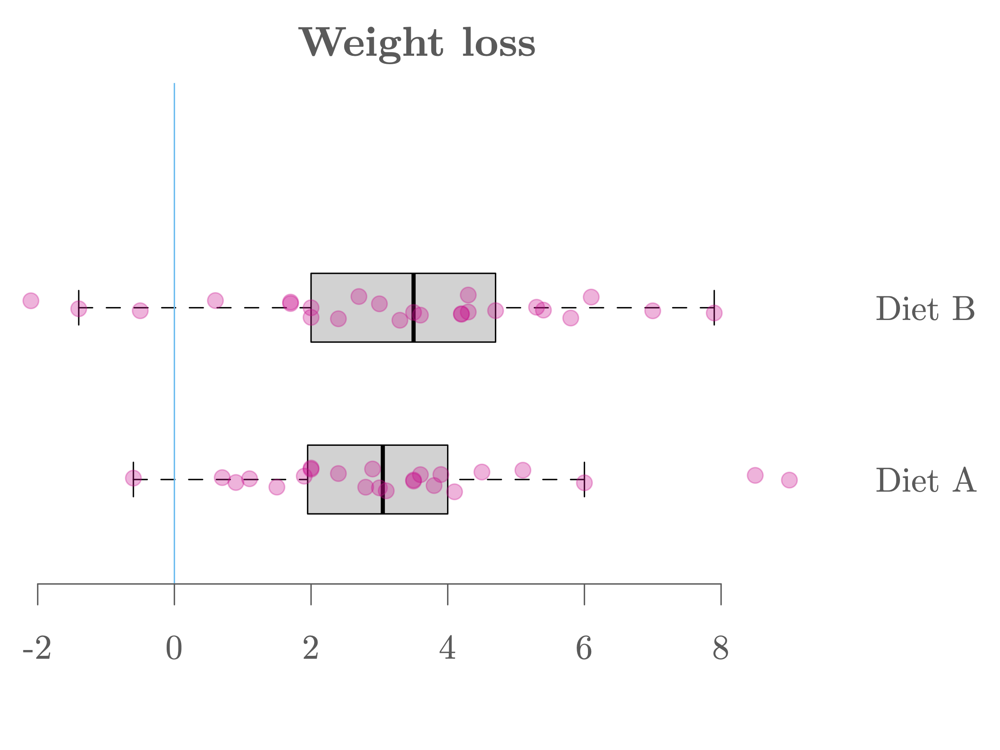
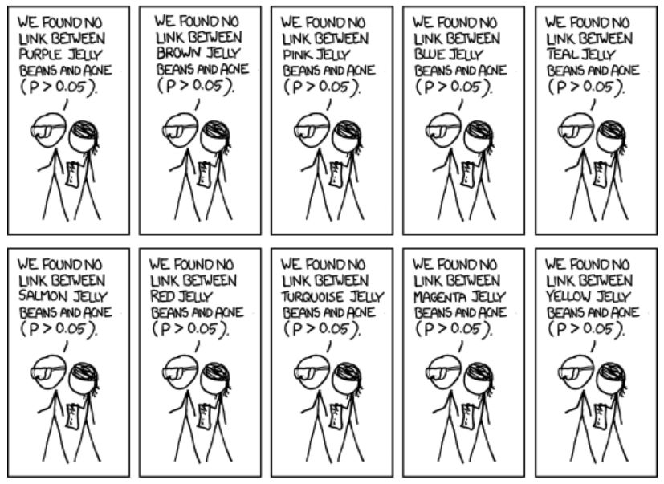
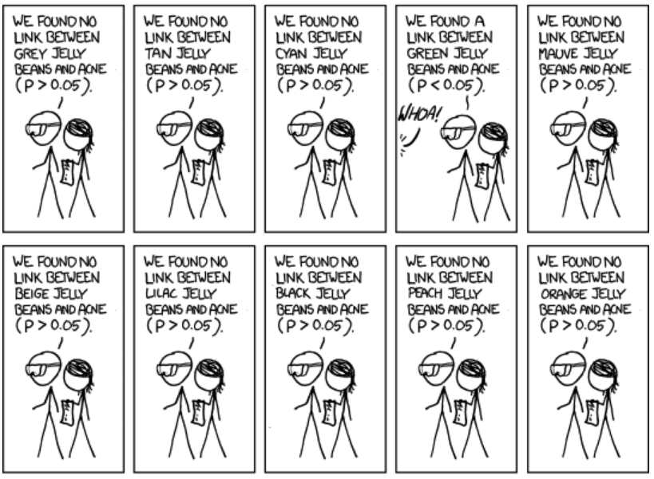
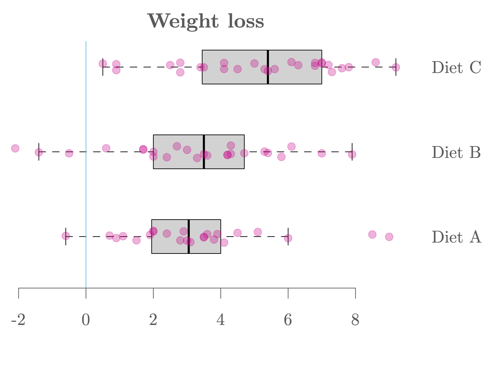

```{R, setup, include = F}
# devtools::install_github("dill/emoGG")
library(pacman)
p_load(
  broom, tidyverse,
  latex2exp, ggplot2, ggthemes, ggforce, viridis, extrafont, gridExtra,
  kableExtra, snakecase, janitor,
  data.table, dplyr, estimatr,
  lubridate, knitr, parallel,
  lfe,
  here, magrittr
)
# Define pink color
red_pink <- "#e64173"
turquoise <- "#20B2AA"
orange <- "#FFA500"
red <- "#fb6107"
blue <- "#2b59c3"
green <- "#8bb174"
grey_light <- "grey70"
grey_mid <- "grey50"
grey_dark <- "grey20"
grey = "#b4b4b4"
purple <- "#6A5ACD"
slate <- "#314f4f"
# Dark slate grey: #314f4f
# Knitr options
opts_chunk$set(
  comment = "#>",
  fig.align = "center",
  fig.height = 7,
  fig.width = 10.5,
  warning = F,
  message = F
)
opts_chunk$set(dev = "svg")
options(device = function(file, width, height) {
  svg(tempfile(), width = width, height = height)
})
options(crayon.enabled = F)
options(knitr.table.format = "html")
# A blank theme for ggplot
theme_empty <- theme_bw() + theme(
  line = element_blank(),
  rect = element_blank(),
  strip.text = element_blank(),
  axis.text = element_blank(),
  plot.title = element_blank(),
  axis.title = element_blank(),
  plot.margin = structure(c(0, 0, -0.5, -1), unit = "lines", valid.unit = 3L, class = "unit"),
  legend.position = "none"
)
theme_simple <- theme_bw() + theme(
  line = element_blank(),
  panel.grid = element_blank(),
  rect = element_blank(),
  strip.text = element_blank(),
  axis.text.x = element_text(size = 18, family = "STIXGeneral"),
  axis.text.y = element_blank(),
  axis.ticks = element_blank(),
  plot.title = element_blank(),
  axis.title = element_blank(),
  # plot.margin = structure(c(0, 0, -1, -1), unit = "lines", valid.unit = 3L, class = "unit"),
  legend.position = "none"
)
theme_axes_math <- theme_void() + theme(
  text = element_text(family = "MathJax_Math"),
  axis.title = element_text(size = 22),
  axis.title.x = element_text(hjust = .95, margin = margin(0.15, 0, 0, 0, unit = "lines")),
  axis.title.y = element_text(vjust = .95, margin = margin(0, 0.15, 0, 0, unit = "lines")),
  axis.line = element_line(
    color = "grey70",
    size = 0.25,
    arrow = arrow(angle = 30, length = unit(0.15, "inches")
  )),
  plot.margin = structure(c(1, 0, 1, 0), unit = "lines", valid.unit = 3L, class = "unit"),
  legend.position = "none"
)
theme_axes_serif <- theme_void() + theme(
  text = element_text(family = "MathJax_Main"),
  axis.title = element_text(size = 22),
  axis.title.x = element_text(hjust = .95, margin = margin(0.15, 0, 0, 0, unit = "lines")),
  axis.title.y = element_text(vjust = .95, margin = margin(0, 0.15, 0, 0, unit = "lines")),
  axis.line = element_line(
    color = "grey70",
    size = 0.25,
    arrow = arrow(angle = 30, length = unit(0.15, "inches")
  )),
  plot.margin = structure(c(1, 0, 1, 0), unit = "lines", valid.unit = 3L, class = "unit"),
  legend.position = "none"
)
theme_axes <- theme_void() + theme(
  text = element_text(family = "Fira Sans Book"),
  axis.title = element_text(size = 18),
  axis.title.x = element_text(hjust = .95, margin = margin(0.15, 0, 0, 0, unit = "lines")),
  axis.title.y = element_text(vjust = .95, margin = margin(0, 0.15, 0, 0, unit = "lines")),
  axis.line = element_line(
    color = grey_light,
    size = 0.25,
    arrow = arrow(angle = 30, length = unit(0.15, "inches")
  )),
  plot.margin = structure(c(1, 0, 1, 0), unit = "lines", valid.unit = 3L, class = "unit"),
  legend.position = "none"
)
theme_set(theme_gray(base_size = 20))
# Column names for regression results
reg_columns <- c("Term", "Est.", "S.E.", "t stat.", "p-Value")
# Function for formatting p values
format_pvi <- function(pv) {
  return(ifelse(
    pv < 0.0001,
    "<0.0001",
    round(pv, 4) %>% format(scientific = F)
  ))
}
format_pv <- function(pvs) lapply(X = pvs, FUN = format_pvi) %>% unlist()
# Tidy regression results table
tidy_table <- function(x, terms, highlight_row = 1, highlight_color = "black", highlight_bold = T, digits = c(NA, 3, 3, 2, 5), title = NULL) {
  x %>%
    tidy() %>%
    select(1:5) %>%
    mutate(
      term = terms,
      p.value = p.value %>% format_pv()
    ) %>%
    kable(
      col.names = reg_columns,
      escape = F,
      digits = digits,
      caption = title
    ) %>%
    kable_styling(font_size = 20) %>%
    row_spec(1:nrow(tidy(x)), background = "white") %>%
    row_spec(highlight_row, bold = highlight_bold, color = highlight_color)
}
```

```{css, echo = F, eval = F}
@media print {
  .has-continuation {
    display: block !important;
  }
}
```

```{r xaringan-tile-view, echo=FALSE}
xaringanExtra::use_tile_view()
xaringanExtra::use_panelset()
xaringanExtra::use_clipboard()
xaringanExtra::use_extra_styles()
```


class: title-slide  
<div class="my-logo-right"></div>
<br>
<br>
<br>
<br>
 
# Data Analytics for Pharmaceutical Sciences

## Part II: Analysis of Variance (ANOVA)

### .smaller[Stéphane Guerrier, Data Analytics Lab, University of Geneva 🇨🇭]
### .smaller[Dominique-L. Couturier, Cancer Research UK, University of Cambridge 🇬🇧]
### .smaller[Yuming Zhang, Data Analytics Lab, University of Geneva 🇨🇭]

<br>
```{R, out.width = "25%", echo = F}
include_graphics("pics/liscence.png")
```
.center[.tiny[License: [CC BY NC SA 4.0](https://creativecommons.org/licenses/by-nc-sa/4.0/)]]

### .tiny[This document was prepared with the help of Lionel Voirol, Wenfei Chu and Jun Wu.]

---

# .smaller[Two-sample location tests]

In practice, we often encounter problems where our goal is .pink[to compare the means (or locations) of two samples]. For example,
1. A scientist is interested in comparing the vaccine efficacy of the Pfizer-BioNTech and the Moderna vaccine.
2. A bank wants to know which of two proposed plans will most increase the use of its credit cards.
3. A psychologist wants to compare male and female college students' impression on a selected webpage.

We will discuss three .pink[two-sample location tests]:
1. .purple[Two independent sample Student's t-test]
2. .purple[Two independent sample Welch's t-test]
3. .purple[Two independent sample Mann-Whitney-Wilcoxon test]

---

# .smaller[Two independent sample Student's t-test]

This test considers the following assumed model for group .hi-purple2[A] and .hi-blue[B]

$$X_{i(g)} = \color{#eb078e}{\mu_{g}} + \varepsilon_{i(g)} = \mu + \color{#eb078e}{\delta_{g}} + \varepsilon_{i(g)},$$
where $g=A,B$, $i=1,...,n_{g}$, $\varepsilon_{i(g)} \overset{iid}{\sim} \mathcal{N}(0,\color{#eb078e}{\sigma^{2}})$ and $\sum n_{g}\delta_{g} =0$. 

📝 $\color{#6A5ACD}{n_A}$ $=$ sample size of group .hi-purple2[A], $\color{#6A5ACD}{\mu_{A} = \mu + \delta_A}$ $=$ population mean of group .hi-purple2[A], $\color{#06bcf1}{n_B}$ and $\color{#06bcf1}{\mu_{B} = \mu + \delta_B}$ are similarly defined for group .hi-blue[B].

Hypotheses:

$$H_0: \color{#6A5ACD}{\mu_A} - \color{#06bcf1}{\mu_B} \color{#eb078e}{=} \mu_0 \ \ \ \ \text{and} \ \ \ \ H_a: \color{#6A5ACD}{\mu_A} - \color{#06bcf1}{\mu_B} \ \big[ \color{#eb078e}{>} \text{ or } \color{#eb078e}{<} \text{ or } \color{#eb078e}{\neq} \big] \ \mu_0.$$

Test statistic's distribution under $H_0$:

$$\color{#b4b4b4}{T = \frac{(\overline{X}_{A}-\overline{X}_{B})-\mu_0}{s_{p}\sqrt{n_{A}^{-1}+n_{B}^{-1}}} \ {\underset{H_0}{\sim}} \ \text{Student}(n_{A}+n_{B}-2).}$$ 
---

# .smaller[Discussion - Student's t-test]

- R function: 

.center[
`t.test(x = ..., y = ..., alternative = ..., var.equal = TRUE)`.]

- This test strongly relies on the .pink[assumed absence of outliers]. If outliers appear to be present the Mann-Whitney-Wilcoxon test (see later) is (probably) a better option.
- For moderate and small sample sizes, the sample distribution should be at least .pink[approximately normal] with no strong skewness to ensure the reliability of the test.
- In practice, the assumption of equal variance is hard to verify so .hi.pink[we recommend to avoid this test in practice].

---

# .smaller[Two independent sample Welch's t-test]

This test considers the following assumed model for group .hi-purple2[A] and .hi-blue[B]

$$X_{i(g)} = \color{#eb078e}{\mu_{g}} + \varepsilon_{i(g)} = \mu + \color{#eb078e}{\delta_{g}} + \varepsilon_{i(g)},$$
where $g=A,B$, $i=1,...,n_{g}$, $\varepsilon_{i(g)} \overset{iid}{\sim} \mathcal{N}(0,\color{#eb078e}{\sigma^{2}_g})$ and $\sum n_{g}\delta_{g} =0$. 

📝 $\color{#6A5ACD}{n_A}$ $=$ sample size of group .hi-purple2[A], $\color{#6A5ACD}{\mu_{A} = \mu + \delta_A}$ $=$ population mean of group .hi-purple2[A], $\color{#06bcf1}{n_B}$ and $\color{#06bcf1}{\mu_{B} = \mu + \delta_B}$ are similarly defined for group .hi-blue[B].

Hypotheses: 

$$H_0: \color{#6A5ACD}{\mu_A} - \color{#06bcf1}{\mu_B} \color{#eb078e}{=} \mu_0 \ \ \ \ \text{and} \ \ \ \ H_a: \color{#6A5ACD}{\mu_A} - \color{#06bcf1}{\mu_B} \ \big[ \color{#eb078e}{>} \text{ or } \color{#eb078e}{<} \text{ or } \color{#eb078e}{\neq} \big] \ \mu_0.$$

Test statistic's distribution under $H_0$:

$$\color{#b4b4b4}{T = \frac{(\overline{X}_{A}-\overline{X}_{B})-\mu_0}{\sqrt{s^2_A/n_{A} + s^2_B/n_{B}}} \ {\underset{H_0}{\sim}} \ \text{Student}(df).}$$ 

---

# .smaller[Discussion - Welch's t-test]

- R function: 

.center[
`t.test(x = ..., y = ..., alternative = ...)`.]

- This test strongly relies on the .pink[assumed absence of outliers]. If outliers appear to be present the Mann-Whitney-Wilcoxon test (see later) is (probably) a better option.
- For moderate and small sample sizes, the sample distribution should be at least .pink[approximately normal] with no strong skewness to ensure the reliability of the test.
- This test does not require the variances of the two groups to be equal. If the variances of the two groups are the same (which is rather unlikely in practice), the Welch's t-test loses a little bit of power compared to the Student's t-test.
- The computation of $df$ (i.e. the degrees of freedom of the distribution under the null) is beyond the scope of this class.

---

# .smaller[Mann-Whitney-Wilcoxon test]

This test considers the following assumed model for group .hi-purple2[A] and .hi-blue[B]

$$X_{i(g)} = \color{#eb078e}{\theta_{g}} + \varepsilon_{i(g)} = \theta + \color{#eb078e}{\delta_{g}} + \varepsilon_{i(g)},$$
where $g=A,B$, $i=1,...,n_{g}$, $\varepsilon_{i(g)} \overset{iid}{\sim} (0,\color{#eb078e}{\sigma^{2}})$ and $\sum n_{g}\delta_{g} =0$. 

📝 $\color{#6A5ACD}{n_A}$ $=$ sample size of group .hi-purple2[A], $\color{#6A5ACD}{\theta_{A} = \theta + \delta_A}$ $=$ population .pink[location] of group .hi-purple2[A], $\color{#06bcf1}{n_B}$ and $\color{#06bcf1}{\theta_{B} = \theta + \delta_B}$ are similarly defined for group .hi-blue[B].

Hypotheses: $H_0: \color{#6A5ACD}{\theta_A} - \color{#06bcf1}{\theta_B} \color{#eb078e}{=} \theta_0 \ \ \ \ \text{and} \ \ \ \ H_a: \color{#6A5ACD}{\theta_A} - \color{#06bcf1}{\theta_B} \ \big[ \color{#eb078e}{>} \text{ or } \color{#eb078e}{<} \text{ or } \color{#eb078e}{\neq} \big] \ \theta_0.$

Test statistic's distribution under $H_0$:

$$\color{#b4b4b4}{Z = \frac{\sum_{i=1}^{n_{B}}R_{i(g)}-[n_{B}(n_{A}+n_{B}+1)/2]}{\sqrt{n_{A}n_{B}(n_{A}+n_{B}+1)/12}},}$$
.grey[where] $\color{#b4b4b4}{R_{i(g)}}$ .grey[denotes the global rank of the] $\color{#b4b4b4}{i}$.grey[-th observation of group] $\color{#b4b4b4}{g}$.grey[.]

---

# .smaller[Discussion - Mann-Whitney-Wilcoxon test]

- R function: `wilcox.test(x = ..., y = ..., alternative = ...)`.
- This test is ".pink[robust]" in the sense that (unlike the t-tests) it is not overly affected by outliers.
- For the Mann-Whitney-Wilcoxon test to be comparable to the t-tests (i.e. testing for the mean) we need to assume: (1) The distributions are symmetric, (2) the variances are the same. Then, we have $\color{#6A5ACD}{\theta_A = \mu_A}$ and $\color{#06bcf1}{\theta_B = \mu_B}$.
- Compared to the t-tests, the Mann-Whitney-Wilcoxon test is less powerful if their requirements (Gaussian and possibly same variances) are met.
- The distribution of this method under the null is complicated and can be obtained by different methods (e.g. exact, asymptotic normal, ...). The details are beyond the scope of this class.
 
---

# Comparing diets A and B 

.panelset[
.panel[.panel-name[Graph]
```{R, dietB, out.width = "80%", echo = F}

```
]
.panel[.panel-name[Import]
```{r xaringan-extra-styles}
# Import data
library(idarps)
data(diet)

# Compute weight loss
diet$weight.loss = diet$initial.weight - diet$final.weight

# Select diet
posA = diet$diet.type=="A"
posB = diet$diet.type=="B"

# Variable of interest
dietA = diet$weight.loss[posA]
dietB = diet$weight.loss[posB]
```
]
.panel[.panel-name[Student]
```{r}
t.test(dietA, dietB, var.equal = TRUE)
```
]
.panel[.panel-name[Welch]
```{r}
t.test(dietA, dietB)
```
]
.panel[.panel-name[Wilcox]
```{r}
wilcox.test(dietA, dietB)
```
]
.panel[.panel-name[Results]
1. .purple[Define hypotheses:] $H_0: \mu_A = \mu_B$ and $H_a: \mu_A \color{#e64173}{\neq} \mu_B$.
2. .purple[Define] $\color{#373895}{\alpha}$: We consider $\alpha = 5\%$.
3. .purple[Compute p-value]: Welch's t-test appears suitable in this case, and therefore, we obtain: p-value =  $96.22 \%$ (see R output tab for details).
4. .purple[Conclusion:] We have p-value > $\alpha$ so we fail to reject the null hypothesis at the significance level of 5%.
]
]

---

# Problems with multiple samples

In practice, we often even encounter situations where we need to .pink[compare the means of more than 2 groups]. For example, we want to compare the weight loss efficacy of several diets, say diets .hi-purple2[A], .hi-blue[B], .hi-green[C]. Your theory could, for example, be the following: $0 < \color{#6A5ACD}{\mu_A} = \color{#06bcf1}{\mu_B} < \color{#8bb174}{\mu_C}$. A possible approach to evaluate its validity:

1. Show that $\color{#8bb174}{\mu_C}$ is greater than $\color{#6A5ACD}{\mu_A}$ and $\color{#06bcf1}{\mu_B}$ (i.e. Test 1:  $H_0$: $\color{#6A5ACD}{\mu_A} = \color{#8bb174}{\mu_C}$, $H_a$: $\color{#6A5ACD}{\mu_A} < \color{#8bb174}{\mu_C}$; Test 2: $H_0$: $\color{#06bcf1}{\mu_B} = \color{#8bb174}{\mu_C}$, $H_a$: $\color{#06bcf1}{\mu_B} < \color{#8bb174}{\mu_C}$). Here we hope to reject $H_0$ in both cases.
2. Show that $\color{#6A5ACD}{\mu_A}$ and $\color{#06bcf1}{\mu_B}$ are greater than 0 (i.e. Test 3:  $H_0$: $\color{#6A5ACD}{\mu_A} = 0$, $H_a$: $\color{#6A5ACD}{\mu_A} > 0$; Test 4: $H_0$: $\color{#06bcf1}{\mu_B} = 0$, $H_a$: $\color{#06bcf1}{\mu_B} >0$). Here we also hope to reject $H_0$ in both cases.
3. Compare $\color{#6A5ACD}{\mu_A}$ and $\color{#06bcf1}{\mu_B}$ (i.e. Test 5: $H_0$: $\color{#6A5ACD}{\mu_A} = \color{#06bcf1}{\mu_B}$, $H_a$: $\color{#6A5ACD}{\mu_A} \neq \color{#06bcf1}{\mu_B}$). Here we hope not to reject $H_0$. ⚠️ This does not imply that $\color{#6A5ACD}{\mu_A} = \color{#06bcf1}{\mu_B}$ is true but at least the result would not contradict our theory.

---

# .smaller[Is there a problem in doing many tests?]

.purple[Are jelly beans causing acne? Maybe... but why only green ones?] 🤨 

```{R, green, out.width = "45%", echo = F}
include_graphics("pics/green.png")
```
.tiny[Source: [xkcd](https://xkcd.com/882/)]
---

# .smaller[Are jelly beans causing acne?]

<br>
```{R, green1, out.width = "85%", echo = F}
include_graphics("pics/green1.png")
```
.tiny[Source: [xkcd](https://xkcd.com/882/)]

---

# .smaller[Maybe a specific color?]

<br>
```{R, green2, out.width = "76%", echo = F}

```
.tiny[Source: [xkcd](https://xkcd.com/882/)]

---

# .smaller[Maybe a specific color?]

<br>
```{R, green3, out.width = "75%", echo = F}

```
.tiny[Source: [xkcd](https://xkcd.com/882/)]

---

# .smaller[And finally...]

```{R, greenagain, out.width = "45%", echo = F}
include_graphics("pics/green.png")
```
.tiny[Source: [xkcd](https://xkcd.com/882/)]

👋 .smallest[If you want to know more about this comics have a look [here](https://www.explainxkcd.com/wiki/index.php/882:_Significant).]

---

# .smaller[Multiple testing can be dangerous!]

- Remember that a p-value is .purple2[random] as its value depends on the data.
- If multiple hypotheses are tested, the chance of observing a rare event increases, and therefore, the chance to incorrectly reject a null hypothesis (i.e. making a Type I error) increases.
- For example, if we consider $k$ (independent) tests (whose null hypotheses are all correct), we have

$$\begin{align}
\alpha_k &= \Pr(\text{reject } H_0 \text{ at least once}) \\
&= 1 - \Pr(\text{not reject } H_0 \text{ test 1}) \times \ldots \times \Pr(\text{not reject } H_0 \text{ test k})\\
&= 1 - (1-\alpha) \times \ldots \times (1-\alpha) = 1 - (1-\alpha)^k
\end{align}$$

- Therefore, $\alpha_k$ increases rapidly with $k$ (e.g. $\alpha_1 = 0.05$, $\alpha_2 \approx 0.098$, $\alpha_{10} \approx 0.4013$, $\alpha_{100} \approx 0.9941$).
- Hence .pink[performing multiple tests, with the same or different data, is dangerous] ⚠️ (but very common! 😟) as it can lead to significant results, when actually there are none!

---

# .smaller[Possible solutions]

Suppose that we are interested in making $k$ tests and that we want the probability of rejecting the null at least once (assuming the null hypotheses to be correct for all tests) $\alpha_k$ to be equal to $\alpha$ (typically 5%). Instead of using $\alpha$ for the individual tests we will use $\alpha_c$ (i.e. a corrected $\alpha$). Then, for $k$ (potentially .purple2[dependent]) tests we have

$$\begin{align}
\alpha_k &= \alpha = \Pr(\text{reject } H_0 \text{ at least once}) \\
&= \Pr(\text{reject } H_0 \text{ test 1} \text{ OR } \ldots \text{ OR } \text{reject } H_0 \text{ test k})\\
&\color{#eb078e}{\leq} \sum_{i = 1}^k \Pr(\text{reject } H_0 \text{ test i}) = \alpha_c \times k.
\end{align}$$

Solving for $\alpha_c$ we obtain: $\color{#6A5ACD}{\alpha_c = \alpha/k}$, which is called .pink[Bonferroni correction]. By making use of the .pink[Boole's inequality], this approach does not require any assumptions about dependence among the tests or about how many of the null hypotheses are true.

---

# .smaller[Possible solutions]

The Bonferroni correction can be conservative if there are a large number of tests, as it comes at the cost of reducing the power of the individual tests (e.g. if $\alpha = 5\%$ and $k = 20$, we get $\alpha_c = 0.05/20 = 0.25\%$). There exists a (slightly) "tighter" bound for $\alpha_k$, which is given by

$$\alpha_k = \Pr(\text{reject } H_0 \text{ at least once}) \color{#eb078e}{\leq} 1 - (1 - \alpha_c)^k.$$
Solving for $\alpha_c$ we obtain: $\color{#6A5ACD}{\alpha_c = 1 - (1 - \alpha)^{1/k}}$, which is called .pink[Dunn–Šidák correction]. This correction is (slightly) less stringent than the Bonferroni correction (since $1 - (1 - \alpha)^{1/k} > \alpha/k$ for $k \geq 2$).

There exist many other alternative methods for multiple testing corrections. It is important to mention that when $k$ is large (say $>$ 100) the Bonferroni and Dunn–Šidák corrections become inapplicable and methods based on the idea of .pink[False Discovery Rate] should be preferred. However, these recent methods are beyond the scope of this class.

---

# .smaller[Multiple-sample location tests]

To compare several means of different populations, a standard approach is to start our analysis by using the .pink[multiple-sample location tests]. More precisely, we proceed our analysis with the following steps:

  - .purple2[Step 1:] We first perform the multiple-sample location tests, where the null hypothesis states that all the locations are the same. If we cannot reject the null hypothesis, we stop our analysis here. Otherwise, we move on to Step 2.
  - .purple2[Step 2:] We compare the groups mutually (using $\alpha_c$) with two-sample location tests in order to verify our hypothesis.
  
We will discuss three .pink[multiple-sample location tests]:

 1. .purple2[Fisher's one-way ANalysis Of VAriance (ANOVA)]
 2. .purple2[Welch's one-way ANOVA]
 3. .purple2[Kruskal-Wallis test]

---

# Fisher's one-way ANOVA

.smallest[This test considers the following assumed model for G groups]
$$\small X_{i(g)} = \color{#eb078e}{\mu_{g}} + \varepsilon_{i(g)} = \mu + \color{#eb078e}{\delta_{g}} + \varepsilon_{i(g)},$$
.smallest[where] $\small g=1,\ldots, G$, $i=1,...,n_{g}$, $\small \varepsilon_{i(g)} \overset{iid}{\sim} \mathcal{N}(0,\color{#eb078e}{\sigma^{2}})$ .smallest[and] $\small \sum n_{g}\delta_{g}=0$. 

📝 $\small n_i =$ .smallest[sample size of group] $\small i$, $\small \mu_i = \mu + \delta_i =$ .smallest[population mean of group] $\small i$, $\small i=1,\ldots, G$.

.smallest[Hypotheses:]
$$\small H_0: \color{#6A5ACD}{\mu_1} \color{#eb078e}{=} \color{#06bcf1}{\mu_2} \color{#eb078e}{=} \ldots \color{#eb078e}{=} \color{#8bb174}{\mu_G} \ \ \ \ \text{and} \ \ \ \ H_a: \mu_i \color{#eb078e}{\neq} \mu_j \ \ \text{for at least one pair of} \ \ (i,j).$$

.smallest[Test statistic's distribution under] $\small H_0$:

$\small \color{#b4b4b4}{F = \frac{N s^2_{\overline{X}}}{s_p^2} \ {\underset{H_0}{\sim}} \ \text{Fisher}(G-1, N-G),}$
.smallest[.grey[where]] $\small \color{#b4b4b4}{s^2_{\overline{X}} = \frac{1}{G-1} \sum_{g=1}^G \frac{n_g}{N} (\overline{X}_g - \overline{X})^2}$.smallest[.grey[,]] $\small \color{#b4b4b4}{s_p^2 = \frac{1}{N-G} \sum_{g=1}^G (n_g-1)s_g^2}$.smallest[.grey[,]] $\small \color{#b4b4b4}{N = \sum_{g=1}^G n_g}$.smallest[.grey[, and]] $\small \color{#b4b4b4}{\overline{X} = \frac{1}{N} \sum_{g=1}^G n_g \overline{X}_g}$.smallest[.grey[.]]

---

# Discussion - Fisher's one-way ANOVA

- R function: 

.center[
`aov(response ~ groups, data = mydata)`.]

- This test strongly relies on the .pink[assumed absence of outliers]. If outliers appear to be present the Kruskal-Wallis test (see later) is (probably) a better option.
- For moderate and small sample sizes, the sample distribution should be at least .pink[approximately normal] with no strong skewness to ensure the reliability of the test.
- In practice, the assumption of equal variance is hard to verify so .hi.pink[we recommend to avoid this test in practice].

---

# Welch's one-way ANOVA

.smallest[This test considers the following assumed model for G groups]
$$\small X_{i(g)} = \color{#eb078e}{\mu_{g}} + \varepsilon_{i(g)} = \mu + \color{#eb078e}{\delta_{g}} + \varepsilon_{i(g)},$$
.smallest[where] $\small g=1,\ldots, G$, $i=1,...,n_{g}$, $\small \varepsilon_{i(g)} \overset{iid}{\sim} \mathcal{N}(0,\color{#eb078e}{\sigma_g^{2}})$ .smallest[and] $\small \sum n_{g}\delta_{g}=0$. 

.smallest[Hypotheses:]
$$\small H_0: \color{#6A5ACD}{\mu_1} \color{#eb078e}{=} \color{#06bcf1}{\mu_2} \color{#eb078e}{=} \ldots \color{#eb078e}{=} \color{#8bb174}{\mu_G} \ \ \ \ \text{and} \ \ \ \ H_a: \mu_i \color{#eb078e}{\neq} \mu_j \ \ \text{for at least one pair of} \ \ (i,j).$$

.smallest[Test statistic's distribution under] $\small H_0$:
$$\small \color{#b4b4b4}{F^* = \frac{s^{*^2}_{\overline{X}}}{1+\frac{2(G-2)}{3\Delta}} \ {\underset{H_0}{\sim}} \ \text{Fisher}(G-1, \Delta),}$$
.smallest[.grey[where]] $\small \color{#b4b4b4}{s^{*^2}_{\overline{X}} = \frac{1}{G-1} \sum_{g=1}^G w_g (\overline{X}_g - \overline{X}^*)^2}$.smallest[.grey[,]] $\small \color{#b4b4b4}{\Delta = [\frac{3}{G^2-1} \sum_{g=1}^G \frac{1}{n_g} (1-\frac{w_g}{\sum_{g=1}^G w_g})]^{-1}}$.smallest[.grey[,]] $\small \color{#b4b4b4}{w_g = \frac{n_g}{s_g^2}}$.smallest[.grey[, and]] $\small \color{#b4b4b4}{\overline{X}^* = \sum_{g=1}^G \frac{w_g\overline{X}_g}{\sum_{g=1}^G w_g}}$.smallest[.grey[.]]

---

# Discussion - Welch's one-way ANOVA

- R function: 

.center[
`oneway.test(response ~ groups, data = mydata)`.]

- This test strongly relies on the .pink[assumed absence of outliers]. If outliers appear to be present the Kruskal-Wallis test (see later) is (probably) a better option.
- For moderate and small sample sizes, the sample distribution should be at least .pink[approximately normal] with no strong skewness to ensure the reliability of the test.
- This test does not require the variances of the groups to be equal. If the variances of all the groups are the same (which is rather unlikely in practice), the Welch's one-way ANOVA loses a little bit of power compared to the Fisher's one-way ANOVA.

---

# Kruskal-Wallis test

.smallest[This test considers the following assumed model for G groups]
$$\small X_{i(g)} = \color{#eb078e}{\theta_{g}} + \varepsilon_{i(g)} = \theta + \color{#eb078e}{\delta_{g}} + \varepsilon_{i(g)},$$
.smallest[where] $\small g=1,\ldots, G$, $i=1,...,n_{g}$, $\small \varepsilon_{i(g)} \overset{iid}{\sim} \mathcal{N}(0,\color{#eb078e}{\sigma^{2}})$ .smallest[and] $\small \sum n_{g}\delta_{g}=0$. 

📝 $\small n_i =$ .smallest[sample size of group] $\small i$, $\small \theta_i = \theta + \delta_i =$ .smallest[population .pink[location] of group] $\small i$, $\small i=1,\ldots, G$.

.smallest[Hypotheses:]
$$\small H_0: \color{#6A5ACD}{\theta_1} \color{#eb078e}{=} \color{#06bcf1}{\theta_2} \color{#eb078e}{=} \ldots \color{#eb078e}{=} \color{#8bb174}{\theta_G} \ \ \ \ \text{and} \ \ \ \ H_a: \theta_i \color{#eb078e}{\neq} \theta_j \ \ \text{for at least one pair of} \ \ (i,j).$$

.smallest[Test statistic's distribution under] $\small H_0$: $\small \color{#b4b4b4}{H = \frac{\frac{12}{N(N+1)} \sum_{g=1}^G \frac{\overline{R}_g}{n_g}-3(N-1)}{1-\frac{\sum_{v=1}^V{t_v^3-t_v}}{N^3-N}} \ {\underset{H_0}{\sim}} \mathcal{X}(G-1)}$.smallest[.grey[, where]] $\small \color{#b4b4b4}{\overline{R}_g = \frac{1}{n_g} \sum_{i=1}^{n_g} R_{i(g)}}$ .smallest[.grey[with]] $\small \color{#b4b4b4}{R_{i(g)}}$ .smallest[.grey[denoting the global rank of the]] $\small \color{#b4b4b4}{i^{th}}$ .smallest[.grey[observation of group]] $\small \color{#b4b4b4}{g}$.smallest[.grey[,]] $\small \color{#b4b4b4}{V}$ .smallest[.grey[is the number of different values/levels in]] $\small \color{#b4b4b4}{X}$ .smallest[.grey[and]] $\small \color{#b4b4b4}{t_v}$ .smallest[.grey[denotes the number of times a given value/level occurred in]] $\small \color{#b4b4b4}{X}$.smallest[.grey[.]]

---

# Discussion - Kruskal-Wallis test

- R function: 

.center[
`kruskal.test(response ~ groups, data = mydata)`.]

- This test is ".pink[robust]" in the sense that (unlike the one-way ANOVA) it is not overly affected by outliers.
- For the Kruskal-Wallis test to be comparable to the one-way ANOVAs (i.e. testing for the mean) we need to assume: (1) The distributions are symmetric, (2) the variances are the same. Then, we have $\color{#eb078e}{\theta_i = \mu_i, i=1,\ldots,G}$.
- Compared to the one-way ANOVAs, the Kruskal-Wallis test is less powerful if their requirements (Gaussian and possibly same variances) are met.

---

# .smaller[Exercise: Comparing diets A, B and C]

.panelset[
.panel[.panel-name[Graph]
```{R, dietABC, out.width = "80%", echo = F}

```
]
.panel[.panel-name[Import]
```{r, eval=FALSE}
# Import data and compute weight loss
library(idarps)
data(diet)
diet$weight.loss = diet$initial.weight - diet$final.weight

# Variable of interest
dietA = diet$weight.loss[diet$diet.type=="A"]
dietB = diet$weight.loss[diet$diet.type=="B"]
dietC = diet$weight.loss[diet$diet.type=="C"]

# Create data frame
dat = data.frame(response = c(dietA, dietB, dietC), 
                 groups = c(rep("A", length(dietA)), 
                            rep("B", length(dietB)), 
                            rep("C", length(dietC))))
```
]
]
