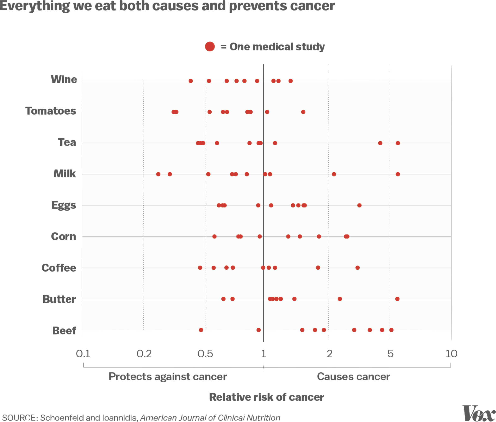

```{R, setup, include = F}
# devtools::install_github("dill/emoGG")
library(pacman)
p_load(
  broom, tidyverse,
  latex2exp, ggplot2, ggthemes, ggforce, viridis, extrafont, gridExtra,
  kableExtra, snakecase, janitor,
  data.table, dplyr, estimatr,
  lubridate, knitr, parallel,
  lfe,
  here, magrittr
)
# Define pink color
red_pink <- "#e64173"
turquoise <- "#20B2AA"
orange <- "#FFA500"
red <- "#fb6107"
blue <- "#2b59c3"
green <- "#8bb174"
grey_light <- "grey70"
grey_mid <- "grey50"
grey_dark <- "grey20"
purple <- "#6A5ACD"
slate <- "#314f4f"
# Dark slate grey: #314f4f
# Knitr options
opts_chunk$set(
  comment = "#>",
  fig.align = "center",
  fig.height = 7,
  fig.width = 10.5,
  warning = F,
  message = F
)
opts_chunk$set(dev = "svg")
options(device = function(file, width, height) {
  svg(tempfile(), width = width, height = height)
})
options(crayon.enabled = F)
options(knitr.table.format = "html")
# A blank theme for ggplot
theme_empty <- theme_bw() + theme(
  line = element_blank(),
  rect = element_blank(),
  strip.text = element_blank(),
  axis.text = element_blank(),
  plot.title = element_blank(),
  axis.title = element_blank(),
  plot.margin = structure(c(0, 0, -0.5, -1), unit = "lines", valid.unit = 3L, class = "unit"),
  legend.position = "none"
)
theme_simple <- theme_bw() + theme(
  line = element_blank(),
  panel.grid = element_blank(),
  rect = element_blank(),
  strip.text = element_blank(),
  axis.text.x = element_text(size = 18, family = "STIXGeneral"),
  axis.text.y = element_blank(),
  axis.ticks = element_blank(),
  plot.title = element_blank(),
  axis.title = element_blank(),
  # plot.margin = structure(c(0, 0, -1, -1), unit = "lines", valid.unit = 3L, class = "unit"),
  legend.position = "none"
)
theme_axes_math <- theme_void() + theme(
  text = element_text(family = "MathJax_Math"),
  axis.title = element_text(size = 22),
  axis.title.x = element_text(hjust = .95, margin = margin(0.15, 0, 0, 0, unit = "lines")),
  axis.title.y = element_text(vjust = .95, margin = margin(0, 0.15, 0, 0, unit = "lines")),
  axis.line = element_line(
    color = "grey70",
    size = 0.25,
    arrow = arrow(angle = 30, length = unit(0.15, "inches")
  )),
  plot.margin = structure(c(1, 0, 1, 0), unit = "lines", valid.unit = 3L, class = "unit"),
  legend.position = "none"
)
theme_axes_serif <- theme_void() + theme(
  text = element_text(family = "MathJax_Main"),
  axis.title = element_text(size = 22),
  axis.title.x = element_text(hjust = .95, margin = margin(0.15, 0, 0, 0, unit = "lines")),
  axis.title.y = element_text(vjust = .95, margin = margin(0, 0.15, 0, 0, unit = "lines")),
  axis.line = element_line(
    color = "grey70",
    size = 0.25,
    arrow = arrow(angle = 30, length = unit(0.15, "inches")
  )),
  plot.margin = structure(c(1, 0, 1, 0), unit = "lines", valid.unit = 3L, class = "unit"),
  legend.position = "none"
)
theme_axes <- theme_void() + theme(
  text = element_text(family = "Fira Sans Book"),
  axis.title = element_text(size = 18),
  axis.title.x = element_text(hjust = .95, margin = margin(0.15, 0, 0, 0, unit = "lines")),
  axis.title.y = element_text(vjust = .95, margin = margin(0, 0.15, 0, 0, unit = "lines")),
  axis.line = element_line(
    color = grey_light,
    size = 0.25,
    arrow = arrow(angle = 30, length = unit(0.15, "inches")
  )),
  plot.margin = structure(c(1, 0, 1, 0), unit = "lines", valid.unit = 3L, class = "unit"),
  legend.position = "none"
)
theme_set(theme_gray(base_size = 20))
# Column names for regression results
reg_columns <- c("Term", "Est.", "S.E.", "t stat.", "p-Value")
# Function for formatting p values
format_pvi <- function(pv) {
  return(ifelse(
    pv < 0.0001,
    "<0.0001",
    round(pv, 4) %>% format(scientific = F)
  ))
}
format_pv <- function(pvs) lapply(X = pvs, FUN = format_pvi) %>% unlist()
# Tidy regression results table
tidy_table <- function(x, terms, highlight_row = 1, highlight_color = "black", highlight_bold = T, digits = c(NA, 3, 3, 2, 5), title = NULL) {
  x %>%
    tidy() %>%
    select(1:5) %>%
    mutate(
      term = terms,
      p.value = p.value %>% format_pv()
    ) %>%
    kable(
      col.names = reg_columns,
      escape = F,
      digits = digits,
      caption = title
    ) %>%
    kable_styling(font_size = 20) %>%
    row_spec(1:nrow(tidy(x)), background = "white") %>%
    row_spec(highlight_row, bold = highlight_bold, color = highlight_color)
}
```

```{css, echo = F, eval = F}
@media print {
  .has-continuation {
    display: block !important;
  }
}
```

```{r xaringan-tile-view, echo=FALSE}
xaringanExtra::use_tile_view()
xaringanExtra::use_panelset()
xaringanExtra::use_clipboard()
xaringanExtra::use_extra_styles()
```


class: title-slide  
<div class="my-logo-right"></div>
<br>
<br>
<br>
<br>
 
# Data Analytics for Pharmaceutical Sciences

## Part II: Analysis of Variance (ANOVA)

### .smaller[Stéphane Guerrier, Data Analytics Lab, University of Geneva, 🇨🇭]
### .smaller[Dominique-L. Couturier, Cancer Research UK, University of Cambridge, 🇬🇧]

<br>
<br>
```{R, out.width = "25%", echo = F}
include_graphics("pics/liscence.png")
```
.center[.tiny[License: [CC BY NC SA 4.0](https://creativecommons.org/licenses/by-nc-sa/4.0/)]]

### .tiny[This document was prepared with the help of Wenfei Chu & Yuming Zhang]

---


# .smaller[Two-sample Location Tests]

In practice, we often encounter problems where our goal is .pink[to compare the means (or locations) of two samples]. For example,
1. A scientist is interested in comparing the vaccine efficacy of the Pfizer-BioNTech and the Moderna vaccine.
2. A bank wants to know which of two proposed plans will most increase the use of its credit cards.
3. A psychologist wants to compare male and female college students' impression on a selected webpage.

We will discuss three ".pink[two-sample location tests]":
1. .purple[Two independent sample Student's t-test]
2. .purple[Two independent sample Welch's t-test]
3. .purple[Two independent sample Mann-Whitney-Wilcoxon test]

---

# .smaller[Two Independent Sample Student's t-test]

This test considers the following assumed model for group .hi-purple2[A] and .hi-blue[B]

$$X_{i(g)} = \color{#eb078e}{\mu_{g}} + \varepsilon_{i(g)} = \mu + \color{#eb078e}{\delta_{g}} + \varepsilon_{i(g)},$$
where $g=A,B$, $i=1,...,n_{g}$, $\varepsilon_{i(g)} \overset{iid}{\sim} \mathcal{N}(0,\color{#eb078e}{\sigma^{2}})$ and $\sum n_{g}\delta_{g} = \color{#6A5ACD}{\delta_A} + \color{#06bcf1}{\delta_B}=0$. 

📝 $\color{#6A5ACD}{n_A}$ $=$ sample size of group .hi-purple2[A], $\color{#6A5ACD}{\mu_{A} = \mu + \delta_A}$ $=$ population mean of group .purple2[A], $\color{#06bcf1}{n_B}$ and $\color{#06bcf1}{\mu_{B} = \mu + \delta_B}$ are similarly defined for group .hi-blue[B].

Hypotheses:

$$H_0: \color{#6A5ACD}{\mu_A} - \color{#06bcf1}{\mu_B} \color{#eb078e}{=} \mu_0 \ \ \ \ \text{and} \ \ \ \ H_a: \color{#6A5ACD}{\mu_A} - \color{#06bcf1}{\mu_B} \ \big[ \color{#eb078e}{>} \text{ or } \color{#eb078e}{<} \text{ or } \color{#eb078e}{\neq} \big] \ \mu_0.$$

Test statistic's distribution under $H_0$

$$\color{#b4b4b4}{T = \frac{(\overline{X}_{A}-\overline{X}_{B})-\mu_0}{s_{p}\sqrt{n_{A}^{-1}+n_{B}^{-1}}} \ {\underset{H_0}{\sim}} \ \text{Student}(n_{A}+n_{B}-2).}$$ 
---

# .smaller[Discussion - Student's t-test]

- R function: 

.center[
`t.test(x = ..., y = ..., alternative = ..., var.equal = TRUE)`.]

- This test strongly relies on the .pink[assumed absence of outliers]. If outliers appear to be present the Mann-Whitney-Wilcoxon Test (see later) is (probably) a better option.
- For moderate and small sample sizes, the sample distribution should be at least .pink[approximately normal] with no strong skewness to ensure the reliability of the test.
- In practice, the assumption of equal variance is hard to verify and .hi.pink[we recommend avoiding this test in practice].

---

# .smaller[Two Independent Sample Welch's t-test]

This test considers the following assumed model for group .hi-purple2[A] and .hi-blue[B]

$$X_{i(g)} = \color{#eb078e}{\mu_{g}} + \varepsilon_{i(g)} = \mu + \color{#eb078e}{\delta_{g}} + \varepsilon_{i(g)},$$
where $g=A,B$, $i=1,...,n_{g}$, $\varepsilon_{i(g)} \overset{iid}{\sim} \mathcal{N}(0,\color{#eb078e}{\sigma^{2}_g})$ and $\sum n_{g}\delta_{g} = \color{#6A5ACD}{\delta_A} + \color{#06bcf1}{\delta_B}=0$. 

📝 $\color{#6A5ACD}{n_A}$ $=$ sample size of group .hi-purple2[A], $\color{#6A5ACD}{\mu_{A} = \mu + \delta_A}$ $=$ population mean of group .purple2[A], $\color{#06bcf1}{n_B}$ and $\color{#06bcf1}{\mu_{B} = \mu + \delta_B}$ are similarly defined for group .hi-blue[B].

Hypotheses: 

$$H_0: \color{#6A5ACD}{\mu_A} - \color{#06bcf1}{\mu_B} \color{#eb078e}{=} \mu_0 \ \ \ \ \text{and} \ \ \ \ H_a: \color{#6A5ACD}{\mu_A} - \color{#06bcf1}{\mu_B} \ \big[ \color{#eb078e}{>} \text{ or } \color{#eb078e}{<} \text{ or } \color{#eb078e}{\neq} \big] \ \mu_0.$$

Test statistic's distribution under $H_0$

$$\color{#b4b4b4}{T = \frac{(\overline{X}_{A}-\overline{X}_{B})-\mu_0}{\sqrt{s^2_A/n_{A} + s^2_B/n_{B}}} \ {\underset{H_0}{\sim}} \ \text{Student}(df).}$$ 

---

# .smaller[Discussion - Welch's t-test]

- R function: 

.center[
`t.test(x = ..., y = ..., alternative = ...)`.]

- This test strongly relies on the .pink[assumed absence of outliers]. If outliers appear to be present the Mann-Whitney-Wilcoxon Test (see later) is (probably) a better option.
- For moderate and small sample sizes, the sample distribution should be at least .pink[approximately normal] with no strong skewness to ensure the reliability of the test.
- This test does not require the variances of the two groups to be equal. If the variances of the two groups are the same (which is rather unlikely in practice), the Welch's t-test losses a little bit of power compared to the Student's t-test.
- The computation of $df$ (i.e. the degrees of freedom of the distribution under the null) is beyond the scope of this class.

---

# .smaller[Mann-Whitney-Wilcoxon Test]

This test considers the following assumed model for group .hi-purple2[A] and .hi-blue[B]

$$X_{i(g)} = \color{#eb078e}{\theta_{g}} + \varepsilon_{i(g)} = \theta + \color{#eb078e}{\delta_{g}} + \varepsilon_{i(g)},$$
where $g=A,B$, $i=1,...,n_{g}$, $\varepsilon_{i(g)} \overset{iid}{\sim} (0,\color{#eb078e}{\sigma^{2}})$ and $\sum n_{g}\delta_{g} = \color{#6A5ACD}{\delta_A} + \color{#06bcf1}{\delta_B}=0$. 

📝 $\color{#6A5ACD}{n_A}$ $=$ sample size of group .hi-purple2[A], $\color{#6A5ACD}{\theta_{A} = \theta + \delta_A}$ $=$ population .pink[location] of group .purple2[A], $\color{#06bcf1}{n_B}$ and $\color{#06bcf1}{\theta_{B} = \theta + \delta_B}$ are similarly defined for group .hi-blue[B].

Hypotheses: $H_0: \color{#6A5ACD}{\theta_A} - \color{#06bcf1}{\theta_B} \color{#eb078e}{=} \theta_0 \ \ \ \ \text{and} \ \ \ \ H_a: \color{#6A5ACD}{\theta_A} - \color{#06bcf1}{\theta_B} \ \big[ \color{#eb078e}{>} \text{ or } \color{#eb078e}{<} \text{ or } \color{#eb078e}{\neq} \big] \ \theta_0.$

Test statistic's distribution under $H_0$

$$\color{#b4b4b4}{Z = \frac{\sum_{i=1}^{n_{B}}R_{i(g)}-[n_{B}(n_{A}+n_{B}+1)/2]}{\sqrt{n_{A}n_{B}(n_{A}+n_{B}+1)/12}},}$$
.grey[where] $\color{#b4b4b4}{R_{i(g)}}$ .grey[denotes the global rank of the] $\color{#b4b4b4}{i}$.grey[-th observation of group] $\color{#b4b4b4}{g}$.grey[.]

---

# .smaller[Discussion - Mann-Whitney-Wilcoxon test]

- R function: 

.center[
`wilcox.test(x = ..., y = ..., alternative = ...)`.]

- This test is ".pink[robust]" in the sense that (unlike the t-test) it is not overly affected by outliers.
- The Mann-Whitney-Wilcoxon test does not require the distributions to be Gaussian nor the variances to be the same, however, in this case this method actually tests whether the two distributions are the same. To render the Mann-Whitney-Wilcoxon test comparable to the t-tests we need to assume: (1) The distribution is symmetric, (2) the variances are the same. Then, we have $\color{#6A5ACD}{\theta_A = \mu_A}$ and $\color{#06bcf1}{\theta_B = \mu_B}$.
- Compared to the t-tests, the Mann-Whitney-Wilcoxon test is less power if their requirements (Gaussian and possibly same variances) are met.
- The distribution of this method under the null is complicated and can be obtained by different methods (e.g. exact, asymptotic normal, ...). The details are beyond the scope of this class.
 
---

# Comparing Diet A and B 

.panelset[
.panel[.panel-name[Graph]
```{R, dietB, out.width = "80%", echo = F}
include_graphics("pics/dietAB.png")
```
]
.panel[.panel-name[Import]
```{r xaringan-extra-styles}
# Import data
diet = read.csv("data/diet.csv",row.names=1)

# Compute weight loss
diet$weight.loss = diet$initial.weight - diet$final.weight

# Select diet
posA = diet$diet.type=="A"
posB = diet$diet.type=="B"

# Variable of interest
dietA = diet$weight.loss[posA]
dietB = diet$weight.loss[posB]
```
]
.panel[.panel-name[Student]
```{r}
t.test(dietA, dietB, var.equal = TRUE)
```
]
.panel[.panel-name[Welsh]
```{r}
t.test(dietA, dietB)
```
]
.panel[.panel-name[Wilcox]
```{r}
wilcox.test(dietA, dietB)
```
]
.panel[.panel-name[Results]
1. .purple[Define hypotheses:] $H_0: \mu_A = \mu_B$ and $H_a: \mu_A \color{#e64173}{\neq} \mu_B$.
2. .purple[Define] $\color{#373895}{\alpha}$: We consider $\alpha = 5\%$.
3. .purple[Compute p-value]: Welch's t-test appears suitable in this case, therefore, we obtain: p-value =  $96.22 \%$ (see R output tab for details).
4. .purple[Conclusion:] We have p-value > $\alpha$ and we fail to reject the null hypothesis at the significance level of 5%.
]
]

---


# Problems with multiple samples

In practice, we often even encounter situations where we need to .pink[compare the means of more than 2 groups]. For example,

1. A scientist wants to compare the vaccine efficacy of the Pfizer-BioNTech, the Moderna, and the Sputnik V vaccines.
2. A nutritionist wants to compare the weight loss efficacy of several diets. 

$\mu_A \approx \mu_B < \mu_C$


---

# Jelly beans example

.purple[Are jelly beans causing acne? Maybe... but why only green ones?] 🤨 

```{R, green, out.width = "45%", echo = F}
include_graphics("pics/green.png")
```
.tiny[Source: [xkcd](https://xkcd.com/882/)]
---

# Are jelly beans causing acne?

<br>
```{R, green1, out.width = "85%", echo = F}
include_graphics("pics/green1.png")
```
.tiny[Source: [xkcd](https://xkcd.com/882/)]

---

# Maybe a specific color?

<br>
```{R, green2, out.width = "76%", echo = F}
include_graphics("pics/green2.png")
```
.tiny[Source: [xkcd](https://xkcd.com/882/)]

---

# Maybe a specific color?

<br>
```{R, green3, out.width = "75%", echo = F}

```
.tiny[Source: [xkcd](https://xkcd.com/882/)]

---

# And finally...

```{R, greenagain, out.width = "45%", echo = F}
include_graphics("pics/green.png")
```
.tiny[Source: [xkcd](https://xkcd.com/882/)]

👋 .smallest[If you want to know more about this comics have a look [here](https://www.explainxkcd.com/wiki/index.php/882:_Significant).]

---

# ☠️ Multiple testing can be dangerous!

- .smaller[Remember that a p-value is .hi-pink[random] as its value depends on the data.]
- .smaller[Hence, by chance, it might happen that while the null hypothesis cannot be rejected (supposing it is true), that the p-value is smaller than the set threshold. With the latter chosen as 5%, then, on average, the (sample) p-value is below 5% .purple[once in twenty times!]]
- .smaller[If multiple hypotheses are tested, the chance of observing a rare event increases, and therefore, the chance to incorrectly reject a null hypothesis (i.e., making a Type I error) increases.]
- .smaller[Hence .hi-pink[performing multiple tests, with the same or different data, is dangerous ⚠️] (but very common! 😟) as it automatically leads to .pink[significant results, when actually there are none!]]

---

# ☠️ Multiple testing can be dangerous!

```{R, out.width = "70%", echo = F}

```

.footnote[.smallest[👋] Read the original article: "*This is why you shouldn't believe that exciting new medical study*" [here](https://www.vox.com/2015/3/23/8264355/research-study-hype).]

---

# Methods to remedy such problem

- .smallest[The .hi-pink[Bonferroni correction] is one of the oldest methods proposed to counteract the problem of multiple testing (i.e. potential increased chance to make Type I errors). ]
- .smallest[.purple[It tests each individual hypothesis at a reduced significance level.] For example, if a trial is testing 20 hypotheses with a desired] $\small \alpha = 5\%$.smallest[, then the Bonferroni correction would test each individual hypothesis at] $\small \alpha^* = \alpha/20 = 5\% / 20 = 0.25\%$.smallest[. Therefore, .purple[it controls the familywise error rate at]] $\small \color{#6A5ACD}{\leq \alpha}$.
- .smallest[The Bonferroni correction can be .turquoise[conservative] if there are a large number of tests, as it comes at the cost of reducing the power of the tests.]
- .smallest[Another more recent and less conservative method is the .hi-pink[False Discovery Rate (FDR)]. It provides less stringent control of Type I errors compared to the Bonferroni correction. Thus, the FDR has greater power, yet at the cost of increased numbers of Type I errors.]

---


---


# The two-sample t-test: Example

.panelset[
.panel[.panel-name[Problem]
.smallest[There is emerging evidence of a relationship between timing of feeding and weight regulation. More precisely, it is claimed that .pink[people who have their main meal early tend to lose more weight compared to people who eat late]. We collect weight loss (in kg) data from 12 individuals, where 7 of them are early eaters and 5 of them are late eaters. We want to test if such claim is valid based on the observed sample: 
$$\small \text{Early eaters:} \;\; 6.3 \;\; 15.1 \;\; 9.4 \;\; 16.8 \;\; 10.2 \;\; 8.2 \;\; 12.7 \quad \text{Late eaters:} \;\; 7.8 \;\; 0.2 \;\; 1.5 \;\; 11.5 \;\; 4.6 $$
]
1. .smallest[.purple[Define hypotheses:]] $\small H_0: \mu_{\text{early}} = \mu_{\text{late}}$ .smallest[and] $\small H_a: \mu_{\text{early}} \color{#e64173}{>} \mu_{\text{late}}$.smallest[.]
2. .smallest[.purple[Define]] $\small \color{#6A5ACD}{\alpha}$.smallest[: We consider] $\small \alpha = 5\%$.smallest[.]
3. .smallest[.purple[Compute p-value:] p-value =] $\small 2.122\%$ .smallest[(see R code tab for details).]
4. .smallest[.purple[Conclusion:] We have p-value <] $\small \alpha$ .smallest[so we can reject the null hypothesis at the significance level of 5% and conclude that the early eaters tend to lose more weight compared to late eaters.]
]
.panel[.panel-name[Boxplot Code]
```{r, eval = F}
early_eaters = c(6.3, 15.1, 9.4, 16.8, 10.2, 8.2, 12.7)
late_eaters = c(7.8, 0.2, 1.5, 11.5, 4.6)

boxplot(early_eaters, late_eaters, 
        names = c("Early", "Late"), 
        ylab = "Weight loss (kg)",
        col = c("#F8766D", "#00BFC4"))
points(1:2, c(mean(early_eaters), mean(late_eaters)), 
       pch = 16, col = 1)
```
]
.panel[.panel-name[Boxplot]
```{r, out.width = "80%", echo = F}
early_eaters = c(6.3, 15.1, 9.4, 16.8, 10.2, 8.2, 12.7)
late_eaters = c(7.8, 0.2, 1.5, 11.5, 4.6)

par(mai = c(1,1.5,1,1))
boxplot(early_eaters, late_eaters, col = c("#F8766D", "#00BFC4"), 
        names = c("Early", "Late"), ylab = "Weight loss (kg)", cex.axis = 2, cex.lab = 2)
points(1:2, c(mean(early_eaters), mean(late_eaters)), pch = 16, col = 1, cex = 2)
```
]
.panel[.panel-name[`R` Code ]
```{r}
early_eaters = c(6.3, 15.1, 9.4, 16.8, 10.2, 8.2, 12.7)
late_eaters = c(7.8, 0.2, 1.5, 11.5, 4.6)
t.test(x = early_eaters, y = late_eaters, alternative = "greater")
```
]
]

---

# Wilcoxon rank sum test

- .smallest[Similar to the Wilcoxon signed rank test as a robust <sup>.smallest[👋]</sup> alternative to the one-sample t-test, we can use the .hi-pink[Wilcoxon rank sum test] (also called the Mann-Whitney test) when the normality condition is not satisfied to use two-sample t-test.]
- .smallest[The Wilcoxon rank sum test depends on the .purple[Wilcoxon rank sum statistic], which is the .purple[sum of the ranks of one sample]. As it only uses the ranks of the observations, it is a .turquoise[nonparametric test].]
- .smallest[In the simplest form, the Wilcoxon rank sum test states the hypotheses in terms of .pink[population median]. However, more precisely, it actually tests whether the two distributions are the same, i.e. 😵]
\begin{align}
& \small H_0: \text{The two distributions are the same.} \\
& \small H_a: \text{One distribution has values that are systematically larger (or smaller). }
\end{align}

.footnote[.smallest[👋 Informally, a robust method is such that it is not overly affected by outliers. The usual one-sample and two-sample t-tests are somehow robust in the sense that their results of inference are not very sensitive to moderate lack of normality when the samples are sufficiently large. However, they may still fail when the population distribution shows strong skewness, especially when we have only a few observations.]]

---

# Revisit the weight loss example

.panelset[
.panel[.panel-name[Problem]
.smallest[Let's recall the previous weight loss example. We want to test if .pink[early eaters tend to lose more weight than late eaters]. The sample is as follows: 
$$\small \text{Early eaters:} \;\; 6.3 \;\; 15.1 \;\; 9.4 \;\; 16.8 \;\; 10.2 \;\; 8.2 \;\; 12.7 \quad \text{Late eaters:} \;\; 7.8 \;\; 0.2 \;\; 1.5 \;\; 11.5 \;\; 4.6 $$
]
1. .smallest[.purple[Define hypotheses:]] $\small H_0: \text{median}_{\text{early}} = \text{median}_{\text{late}}$ .smallest[and] $\small H_a: \text{median}_{\text{early}} \color{#e64173}{>} \text{median}_{\text{late}}$.smallest[.]
2. .smallest[.purple[Define]] $\small \color{#6A5ACD}{\alpha}$.smallest[: We consider] $\small \alpha = 5\%$.smallest[.]
3. .smallest[.purple[Compute p-value:] p-value =] $\small 2.399\%$ .smallest[(see R code tab for details).]
4. .smallest[.purple[Conclusion:] We have p-value <] $\small \alpha$ .smallest[so we can reject the null hypothesis at the significance level of 5% and conclude that the early eaters tend to lose more weight compared to late eaters.]
]
.panel[.panel-name[Boxplot Code]
```{r, eval = F}
early_eaters = c(6.3, 15.1, 9.4, 16.8, 10.2, 8.2, 12.7)
late_eaters = c(7.8, 0.2, 1.5, 11.5, 4.6)

boxplot(early_eaters, late_eaters, 
        names = c("Early", "Late"), 
        ylab = "Weight loss (kg)",
        col = c("#F8766D", "#00BFC4"))
points(1:2, c(mean(early_eaters), mean(late_eaters)), 
       pch = 16, col = 1)
```
]
.panel[.panel-name[Boxplot]
```{r, out.width = "80%", echo = F}
early_eaters = c(6.3, 15.1, 9.4, 16.8, 10.2, 8.2, 12.7)
late_eaters = c(7.8, 0.2, 1.5, 11.5, 4.6)

par(mai = c(1,1.5,1,1))
boxplot(early_eaters, late_eaters, col = c("#F8766D", "#00BFC4"), 
        names = c("Early", "Late"), ylab = "Weight loss (kg)", cex.axis = 2, cex.lab = 2)
points(1:2, c(mean(early_eaters), mean(late_eaters)), pch = 16, col = 1, cex = 2)
```
]
.panel[.panel-name[`R` Code ]
```{r}
early_eaters = c(6.3, 15.1, 9.4, 16.8, 10.2, 8.2, 12.7)
late_eaters = c(7.8, 0.2, 1.5, 11.5, 4.6)
wilcox.test(x = early_eaters, y = late_eaters, alternative = "greater")
```
]
]

---

