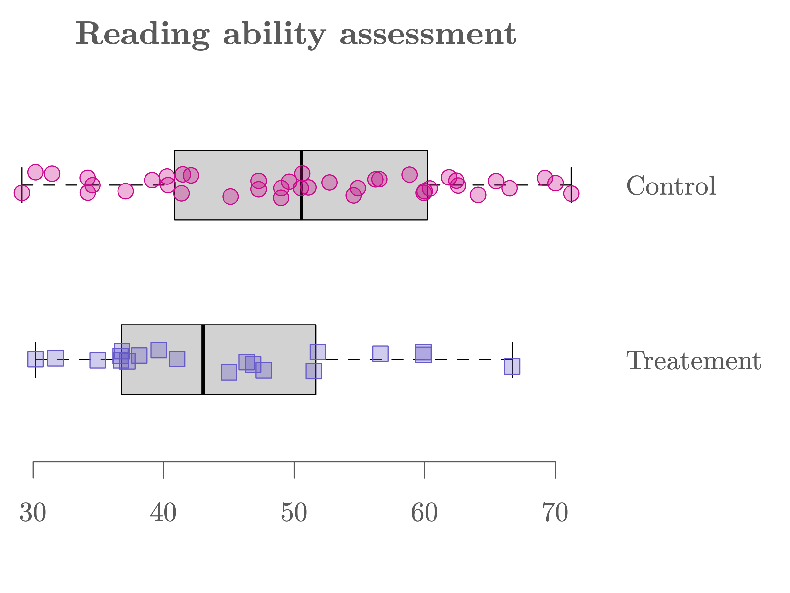

```{R, setup, include = F}
# devtools::install_github("dill/emoGG")
library(pacman)
p_load(
  broom, tidyverse,
  latex2exp, ggplot2, ggthemes, ggforce, viridis, extrafont, gridExtra,
  kableExtra, snakecase, janitor,
  data.table, dplyr, estimatr,
  lubridate, knitr, parallel,
  lfe,
  here, magrittr
)
# Define pink color
red_pink <- "#e64173"
turquoise <- "#20B2AA"
orange <- "#FFA500"
red <- "#fb6107"
blue <- "#2b59c3"
green <- "#8bb174"
grey_light <- "grey70"
grey_mid <- "grey50"
grey_dark <- "grey20"
grey = "#b4b4b4"
purple <- "#6A5ACD"
slate <- "#314f4f"
# Dark slate grey: #314f4f
# Knitr options
opts_chunk$set(
  comment = "#>",
  fig.align = "center",
  fig.height = 7,
  fig.width = 10.5,
  warning = F,
  message = F
)
opts_chunk$set(dev = "svg")
options(device = function(file, width, height) {
  svg(tempfile(), width = width, height = height)
})
options(crayon.enabled = F)
options(knitr.table.format = "html")
# A blank theme for ggplot
theme_empty <- theme_bw() + theme(
  line = element_blank(),
  rect = element_blank(),
  strip.text = element_blank(),
  axis.text = element_blank(),
  plot.title = element_blank(),
  axis.title = element_blank(),
  plot.margin = structure(c(0, 0, -0.5, -1), unit = "lines", valid.unit = 3L, class = "unit"),
  legend.position = "none"
)
theme_simple <- theme_bw() + theme(
  line = element_blank(),
  panel.grid = element_blank(),
  rect = element_blank(),
  strip.text = element_blank(),
  axis.text.x = element_text(size = 18, family = "STIXGeneral"),
  axis.text.y = element_blank(),
  axis.ticks = element_blank(),
  plot.title = element_blank(),
  axis.title = element_blank(),
  # plot.margin = structure(c(0, 0, -1, -1), unit = "lines", valid.unit = 3L, class = "unit"),
  legend.position = "none"
)
theme_axes_math <- theme_void() + theme(
  text = element_text(family = "MathJax_Math"),
  axis.title = element_text(size = 22),
  axis.title.x = element_text(hjust = .95, margin = margin(0.15, 0, 0, 0, unit = "lines")),
  axis.title.y = element_text(vjust = .95, margin = margin(0, 0.15, 0, 0, unit = "lines")),
  axis.line = element_line(
    color = "grey70",
    size = 0.25,
    arrow = arrow(angle = 30, length = unit(0.15, "inches")
  )),
  plot.margin = structure(c(1, 0, 1, 0), unit = "lines", valid.unit = 3L, class = "unit"),
  legend.position = "none"
)
theme_axes_serif <- theme_void() + theme(
  text = element_text(family = "MathJax_Main"),
  axis.title = element_text(size = 22),
  axis.title.x = element_text(hjust = .95, margin = margin(0.15, 0, 0, 0, unit = "lines")),
  axis.title.y = element_text(vjust = .95, margin = margin(0, 0.15, 0, 0, unit = "lines")),
  axis.line = element_line(
    color = "grey70",
    size = 0.25,
    arrow = arrow(angle = 30, length = unit(0.15, "inches")
  )),
  plot.margin = structure(c(1, 0, 1, 0), unit = "lines", valid.unit = 3L, class = "unit"),
  legend.position = "none"
)
theme_axes <- theme_void() + theme(
  text = element_text(family = "Fira Sans Book"),
  axis.title = element_text(size = 18),
  axis.title.x = element_text(hjust = .95, margin = margin(0.15, 0, 0, 0, unit = "lines")),
  axis.title.y = element_text(vjust = .95, margin = margin(0, 0.15, 0, 0, unit = "lines")),
  axis.line = element_line(
    color = grey_light,
    size = 0.25,
    arrow = arrow(angle = 30, length = unit(0.15, "inches")
  )),
  plot.margin = structure(c(1, 0, 1, 0), unit = "lines", valid.unit = 3L, class = "unit"),
  legend.position = "none"
)
theme_set(theme_gray(base_size = 20))
# Column names for regression results
reg_columns <- c("Term", "Est.", "S.E.", "t stat.", "p-Value")
# Function for formatting p values
format_pvi <- function(pv) {
  return(ifelse(
    pv < 0.0001,
    "<0.0001",
    round(pv, 4) %>% format(scientific = F)
  ))
}
format_pv <- function(pvs) lapply(X = pvs, FUN = format_pvi) %>% unlist()
# Tidy regression results table
tidy_table <- function(x, terms, highlight_row = 1, highlight_color = "black", highlight_bold = T, digits = c(NA, 3, 3, 2, 5), title = NULL) {
  x %>%
    tidy() %>%
    select(1:5) %>%
    mutate(
      term = terms,
      p.value = p.value %>% format_pv()
    ) %>%
    kable(
      col.names = reg_columns,
      escape = F,
      digits = digits,
      caption = title
    ) %>%
    kable_styling(font_size = 20) %>%
    row_spec(1:nrow(tidy(x)), background = "white") %>%
    row_spec(highlight_row, bold = highlight_bold, color = highlight_color)
}
```

```{css, echo = F, eval = F}
@media print {
  .has-continuation {
    display: block !important;
  }
}
```

```{r xaringan-tile-view, echo=FALSE}
xaringanExtra::use_tile_view()
xaringanExtra::use_panelset()
xaringanExtra::use_clipboard()
xaringanExtra::use_extra_styles()
```


class: title-slide  
<div class="my-logo-right"></div>
<br>
<br>
<br>
<br>
 
# Data Analytics for Pharmaceutical Sciences

## Part III: Linear Regression

### .smaller[Stéphane Guerrier, Data Analytics Lab, University of Geneva 🇨🇭]
### .smaller[Dominique-L. Couturier, Cancer Research UK, University of Cambridge 🇬🇧]
### .smaller[Yuming Zhang, Data Analytics Lab, University of Geneva 🇨🇭]

<br>
```{R, out.width = "25%", echo = F}
include_graphics("pics/liscence.png")
```
.center[.tiny[License: [CC BY NC SA 4.0](https://creativecommons.org/licenses/by-nc-sa/4.0/)]]

### .tiny[This document was prepared with the help of Wenfei Chu]

---

# .smallest[Motivating Example: Reading Ability]

.panelset[
.panel[.panel-name[Problem]
An educator believes that .purple2[new directed reading activities] in the classroom can help elementary school students (6-12 years old) improve their reading ability. She arranged a pilot study where some students (chosen at random) of age 6 start to take part in these activities .hi-purple2[(treatment group)], meanwhile other students continue with the .pink[classical curriculum] .hi-pink[(control group)]. The educator wishes to evaluate the effectiveness of these activities so all students are given a Degree of Reading Power (DRP) test, which assesses their reading ability. 

.pink[Can we conclude that these new directed reading activities can help elementary school students improve their reading ability?]
]
.panel[.panel-name[Data]

```{r}
dat = read.csv("data/reading.csv")
control = dat$score[dat$group == "Control"]
head(control)
treatment = dat$score[dat$group == "Treatment"]
head(treatment)
```

]
.panel[.panel-name[Graph]

```{R, readingboxplot, out.width = "80%", echo = F}

```

]
.panel[.panel-name[Test]
1. .purple[Define hypotheses:] $H_0: \mu_T = \mu_C$ and $H_a: \mu_T > \mu_C$.
2. .purple[Define] $\color{#6A5ACD}{\alpha}$: We consider $\alpha = 5\%$.
3. .purple[Compute p-value]: p-value = $97.12\%$ (see R code tab for details).
4. .purple[Conclusion:] We have p-value > $\alpha$ so we cannot reject the null hypothesis at the significance level of 5%. 

.hi-pink[Remark:] Notice that the p-value for the test with opposite hypotheses is actually $100\%-97.12\%=2.88\% < \alpha$ (Why? 🤔). So we conclude, at the significance level of 5%, that the classical curriculum without these new directed reading activities actually improve students' reading ability more compared to the curriculum with these activities. 😬
]
.panel[.panel-name[`R` Code ]
```{r}
t.test(treatment, control, alternative = "greater")
```
]
]

---

# .smaller[Is our analysis comprehensive?]

The educator points out that only students of 6-8 years old have participated in the new directed reading activities. In other words, in the sample she collected, the students in the treatment group are only of age 6 to 8, whereas the students in the control group vary from 6 to 12 years old. .pink[Is age a potential explanation to the difference we observe among the students' reading ability?]

To make sure that the analysis is reliable, she includes the age information of the students, which can be accessed as follows:

```{r}
treatment_age = dat$age[dat$group == "Treatment"]
control_age   = dat$age[dat$group == "Control"]
```

---

# .smaller[Should age be taken into account?]

```{R, readingpoint, out.width = "90%", echo = F}
include_graphics("pics/reading_points.png")
```

---

# .smaller[Regression analysis]

- Regression analysis corresponds to a set of statistical methods for estimating the .pink[relationships] between a response variable $Y$ of primary interest (also called the *outcome variable*) and some explanatory variables $X_1, \ldots, X_p$ (also called *covariates*, *regressors*, *features* or *predictors*).
- The relationship between the response variable $Y$ and the covariates is not .purple2[deterministic] and we model the .purple2[conditional expected value] (i.e. $\mathbb{E}[Y | X_1, \ldots, X_p]$).
- Therefore, we consider the following (general) model:
$$Y_i = \mathbb{E}[Y_i | X_{i1}, \ldots, X_{ip}] + \varepsilon_i,$$where $\mathbb{E}[\varepsilon_i] = 0$ and $i=1,\ldots,n$.
- Examples: $\mathbb{E}[\text{reading abilities}_i| \ \text{age}_i, \text{treatment}_i, \ldots]$.

---

# .smaller[Linear regression]

- The most common form of regression analysis is .pink[linear regression], in which 
the conditional expected value $\color{#373895}{\mathbb{E}[Y | X_1, \ldots, X_p]}$ takes the form
$$\color{#373895}{\mathbb{E}[Y_i| X_{i1}, \ldots, X_{ip}]} = \color{#373895}{\beta_0 + \beta_1 X_1 + \ldots + \beta_p X_p}.$$
and $\color{#eb078e}{\varepsilon_i \overset{iid}{\sim} \mathcal{N}(0, \sigma^2)}$.
- Our general model can be expressed as
$$Y_i = \color{#373895}{\mathbb{E}[Y_i | X_{i1}, \ldots, X_{ip}]} + \varepsilon_i = \color{#373895}{\beta_0 + \sum_{j = 1}^p \beta_j X_{ij}} + \varepsilon_i,$$
and therefore,
$$Y_i \color{#eb078e}{ \overset{iid}{\sim} \mathcal{N}}\left(\color{#373895}{\beta_0 + \sum_{j = 1}^p \beta_j X_{ij}}, \color{#eb078e}{\sigma^2}\right).$$

---

# .smaller[Linear regression]

Therefore, this approach makes two (.pink[strong]) assumptions:

1. The conditional expected value $\mathbb{E}[Y | X_1, \ldots, X_p]$ is assumed to be a linear function of the covariates.
2. The errors are assumed to be $iid$ Gaussian, i.e. $\color{#eb078e}{\varepsilon_i \overset{iid}{\sim} \mathcal{N}(0, \sigma^2)}$, at least when the sample size is small to medium.

⚠️ .pink[In practice, it is important to assess if these assumptions are plausible.]

The parameters of the model (i.e. $\beta_1, \ldots, \beta_p$ and $\sigma^2$) can be estimated by several methods. The most commonly used is the .pink[least squares] approach where $\beta_1, \ldots, \beta_p$ are chosen such that

$$\sum_{i = 1}^n \varepsilon_i^2 = \sum_{i = 1}^n \left(Y_i- \mathbb{E}[Y_i | X_{i1}, \ldots, X_{ip}]\right)^2 = \sum_{i = 1}^n \left(Y_i- \beta_0 - \sum_{j = 1}^p \beta_j X_{ij}\right)^2$$
is .pink[minimized].

---

# .smaller[Example: Reading ability assessment]

In the reading ability example, we can formulate a linear regression model (without interaction) as follows:
$$\color{#e64173}{\text{Score}_i} = \beta_0 + \beta_1 \color{#6A5ACD}{\text{Group}_i} + \beta_2 \color{#20B2AA}{\text{Age}_i} + \epsilon_i, \quad \epsilon_i \overset{iid}{\sim} \mathcal{N}(0, \sigma^2).$$
- $\color{#e64173}{\text{Score}_i}$: score of the DRP test of the $i$-th student.
- $\color{#6A5ACD}{\text{Group}_i}$: indicator of participation of the new directed reading activities for the $i$-th student (i.e. $\color{#6A5ACD}{\text{Group}_i} = 1$ if participate and $\color{#6A5ACD}{\text{Group}_i} = 0$ if not participate).
- $\color{#20B2AA}{\text{Age}_i}$: age of the $i$-th student (related to 'time since start of treatment'). 

With this model the two groups can be compared as the age effect is taken into account. The goal of the educator is now to assess if $\beta_1$ is .pink[significantly larger than 0].

---

# .smaller[Example: Reading ability assessment]

.panelset[
.panel[.panel-name[R Code]

.pink[R function]:  `lm(y ~ x1 + ... + xp, data = mydata)`.

Here is the code for our example:

```{r, eval = F}
# Import data (if you haven't already)
dat = read.csv("data/reading.csv")

# Fit linear regression model
mod1 = lm(score ~ group + age, data = dat)
summary(mod1)
```

]
.panel[.panel-name[Output]
```{r, echo = F}
# Import data (if you haven't already)
dat = read.csv("data/reading.csv")

# fit a linear regression model
mod1 = lm(score ~ group + age, data = dat)
summary(mod1)
```
]
]

---

# .smaller[Interpretation of coefficients]

We can obtain the estimated coefficients. Specifically,
- $\hat{\beta}_0 = -7.8639$ represents the estimated baseline average score of the DRP test (at 0 yo).
- $\hat{\beta}_1 = 6.3771$ means that .pink[for a student of the same age], participating in the new directed reading activities is estimated to increase their average score of the DRP test by 6.3771.
- $\hat{\beta}_2 = 6.6457$ means that .pink[when a student receives the same treatment] (either participate or not in the activities), their average score increases by 6.6457 as they become 1 year older. 

Regression coefficients represent the mean change in the response variable .purple[for one unit of change] in the predictor variable .purple[while holding other covariates in the model constant.]

---

# .smaller[Interpretation of coefficient p-values]

- We notice that for each coefficient $\beta_j$, there is a corresponding p-value.
- This coefficient p-value is associated to the (Wald t-)test of $H_0: \beta_j = 0$ and $H_a: \beta_j \neq 0$. 
- .pink[A covariate with a small p-value (typically smaller than 5%) is considered to be a significant (meaningful) addition to the model], as changes in the values of such covariate can lead to changes in the response variable. 
- On the other hand, a large p-value (typically larger than 5%) suggests that the corresponding covariate is not significantly associated with changes in the response or that we have not enough evidence (data) to show its effect.
- In this example, the coefficient p-value associated to the `group` covariate is $2.6 \times 10^{-3}$%. .purple[This suggests that taking into account the effect of `age`, the reading abilities of the students receiving the treatment is significantly .hi.purple[different] from the control group, at the significance level of 5%.] But this is not what we want! 

---

# .smaller[Interpretation of coefficient p-values]

In the linear regression output, the coefficient p-value (which we denote as $p$ below) corresponds to a two-sided test. We can use this result to compute the p-value of a one-sided test using the following relations:

|               | $\small H_a: \beta_j>0$   | $\small H_a: \beta_j<0$  |
| ------------- |:-------------:| :-----:|
| $\small \hat{\beta_j}>0$     | $\small p/2$ | $\small 1-p/2$ |
| $\small \hat{\beta_j}<0$      | $\small 1-p/2$      |   $\small p/2$ |

In our example, $\beta_1 = 6.3771$ and $p=2.6 \times 10^{-3}\%$. So the p-value of the test with hypotheses $H_0: \beta_1=0$ and $H_a: \beta_1>0$ is $2.6 \times 10^{-3}\% /2 \approx 1.3 \times 10^{-3}\%  < \alpha$. So we can conclude that these new directed reading activities can .pink[significantly improve] students' reading ability compared to classical curriculum. 

.purple2[However, is our model plausible?] 🤔

---

# .smaller[How good is our model? 🤔]

```{R, pointswithmod1, out.width = "90%", echo = F}

```

---

# .smaller[Could we use the] $R^2$.smaller[?]

- The .pink[coefficient of determination], denoted as $R^2$ and often referred to as R-squared, corresponds to the proportion of the variance in the response variable that is explained by the model.  
- $\color{#6A5ACD}{R^2}$ .purple[gives certain information about the goodness of fit of a model.] It measures how well the regression predictions approximate the real data points. An $R^2$ of 1 indicates that the regression predictions perfectly fit the data.
-  However, the value of $R^2$ is not related to the adequacy of our model to the data.
- ⚠️ Moreover, adding new covariates to the current model .purple[always] increases $R^2$, whether the additional covariates are significant or not. Therefore, $R^2$ alone cannot be used as a meaningful comparison of models with different covariates.
- The .pink[adjusted] $\color{#e64173}{R^2}$ is a modification of $R^2$ that aims to limit this issue. 

---

# .smaller[Model diagnostic]

```{R, diagmod1, out.width = "90%", echo = F}

```

---

# .smaller[Model diagnostic] ⚠️

```{R, diag_mod1_v2, out.width = "90%", echo = F}

```

---

# .smaller[Model diagnostic] ⚠️

```{R, diag2_mod1, out.width = "90%", echo = F}

```

---

# .smaller[Model diagnostic]

```{R, qqplot_mod1, out.width = "90%", echo = F}

```

---

# .smaller[Let's update our model]

Our results suggest that the students of the group participating in these new directed reading activities progress more rapidly (which is actually more reasonable than our initial model 🤔). Therefore, we modify our model by adding an interaction term:

$$\color{#e64173}{\text{Score}_i} = \beta_0 + \beta_1 \color{#6A5ACD}{\text{Group}_i} + \beta_2 \color{#20B2AA}{\text{Age}_i} + \beta_3 \color{#6A5ACD}{\text{Group}_i}\color{#20B2AA}{\text{Age}_i} + \epsilon_i, \quad \epsilon_i \overset{iid}{\sim} \mathcal{N}(0, \sigma^2).$$
- $\color{#e64173}{\text{Score}_i}$: score of the DRP test of the $i$-th student.
- $\color{#6A5ACD}{\text{Group}_i}$: indicator of participation of the new directed reading activities for the $i$-th student (i.e. $\color{#6A5ACD}{\text{Group}_i} = 1$ if participate and $\color{#6A5ACD}{\text{Group}_i} = 0$ if not participate).
- $\color{#20B2AA}{\text{Age}_i}$: age of the $i$-th student (related to 'time since start of treatment'),
- $\beta_3$ corresponds to the difference in slope between the treatment and control groups.

The goal of the educator is now to assess if $\beta_1$ and/or $\beta_3$ are .pink[significantly larger than 0].

---

# .smaller[Example: Reading ability assessment]

.panelset[
.panel[.panel-name[R Code]

Here is the code to fit our second model:

```{r, eval = F}
# Import data (if you haven't already)
dat = read.csv("data/reading.csv")

# Fit linear regression model
mod2 = lm(score ~ group*age, data = dat)
summary(mod2)
```

]
.panel[.panel-name[Output]
```{r, echo = F}
# Import data (if you haven't already)
dat = read.csv("data/reading.csv")

# fit a linear regression model
mod2 = lm(score ~ group*age, data = dat)
summary(mod2)
```
]
]

---

# .smaller[Interpretation of coefficients]

We can obtain the estimated coefficients. Specifically,
- $\hat{\beta}_0 = -3.2489$ represents the estimated baseline average score of the DRP test (at age 0).
- $\hat{\beta}_1 = -36.0307$ means that .pink[for a student of the same age], participating in the new directed reading activities is estimated to decrease their average score of the DRP test by 36.0307 (does this make sense? 🧐).
- $\hat{\beta}_2 = 6.1207$ means that for students not participating to the new directed reading activities, their average score increases by 6.1207 as they become 1 year older.
- $\hat{\beta}_3 = 5.9539$ means that the average score of students participating in the new directed reading activities increases by 5.9539 as they become 1 year older .pink[compared to the other students]. This means that the average score of students participating to the new program increases by 12.0746 (i.e. 6.1207 + 5.9539) as they become 1 year older.

---

# .smaller[Model fit]

```{R, pointswithmod2, out.width = "90%", echo = F}

```

---

# .smaller[Model diagnostic]

```{R, diag_mod2_v2, out.width = "90%", echo = F}

```

---

# .smaller[Model diagnostic]

```{R, diag2_mod2, out.width = "90%", echo = F}

```

---

# .smaller[Model diagnostic]

```{R, qqplot_mod2, out.width = "90%", echo = F}

```

---

# .smaller[Model selection]

In general, we prefer a .pink[parsimonious approach to modeling] in the sense that we only choose a more complex model if the benefits are ".pink[substantial]"<sup>.smallest[👋]</sup>. We want our model to be such that:

1.  The model fits the data well.
2.  Avoid (excessive) overfitting.

Naturally these two objective are .pink[contradictory] and there are many ways to select a suitable model (actually this is one of the most active areas of research in modern Statistics). In this class, we will only consider one (simple) approach based on the .pink[Akaike Information Criterion (AIC)]. This criterion corresponds to an .purple2[estimator of prediction error] and thereby .purple2[relative quality of statistical models for a given set of data].

.footnote[.smallest[👋  This point of view is based on .pink[Occam's razor] (or law of parsimony), the problem-solving principle stipulating that ".purple2[the simplest explanation is usually the right one]".]]

---

# .smaller[Model selection]

In `R`, the AIC can be computed for a given model (i.e. use the output of the function `lm(...)` in `AIC(model)`. For example, we can compare the AIC of the previously considered models as follows:

```{r}
AIC(mod1)     # First model (no interaction)
AIC(mod2)     # Second model (with interaction)
```

As expected, these results suggests that the second model is more appropriate. .pink[But should we further improve it?]

---

# .smaller[Let's update our model (again)]

It should be reasonable that the average reading scores of the two groups are the same at the start of the program.

$$\color{#e64173}{\text{Score}_i} = \beta_0 + \beta_1 \color{#20B2AA}{(\text{Age}_i - 6)}  + \beta_2 \color{#6A5ACD}{\text{Group}_i}\color{#20B2AA}{(\text{Age}_i - 6)} + \epsilon_i, \quad \epsilon_i \overset{iid}{\sim} \mathcal{N}(0, \sigma^2).$$
- $\color{#e64173}{\text{Score}_i}$: score of the DRP test of the $i$-th student.
- $\color{#6A5ACD}{\text{Group}_i}$: indicator of participation of the new directed reading activities for the $i$-th student (i.e. $\color{#6A5ACD}{\text{Group}_i} = 1$ if participate and $\color{#6A5ACD}{\text{Group}_i} = 0$ if not participate).
- $\color{#20B2AA}{\text{Age}_i}$: age of the $i$-th student. 

With this model the two groups can be compared as the age effect is taken into account. The goal of the educator now is (only!) to assess if $\beta_1$ is .pink[significantly larger than 0].

---

# .smaller[Example: Reading ability assessment]

.panelset[
.panel[.panel-name[R Code]

Here is the code to fit our third model:

```{r, eval = F}
# Import data (if you haven't already)
dat = read.csv("data/reading.csv")
dat$age_minus_6 = dat$age - 6

# Fit linear regression model
mod3 = lm(score ~ age_minus_6 + group:age_minus_6, data = dat)
summary(mod3)
```

]
.panel[.panel-name[Output]
```{r, echo = F}
# Import data (if you haven't already)
dat = read.csv("data/reading.csv")
dat$age_minus_6 = dat$age - 6

# Fit linear regression model
mod3 = lm(score ~ age_minus_6 + group:age_minus_6, data = dat)
summary(mod3)
```
]
.panel[.panel-name[AIC]
```{r}
AIC(mod1)
AIC(mod2)
AIC(mod3)
```
]
]

---

# .smaller[Model fit]

```{R, pointswithmod3, out.width = "90%", echo = F}

```

---

# .smaller[Model diagnostic]

```{R, diag_mod3_v2, out.width = "90%", echo = F}
include_graphics("pics/diag_mod3_v2.png")
```

---

# .smaller[Model diagnostic]

```{R, diag2_mod3, out.width = "90%", echo = F}

```

---

# .smaller[Model diagnostic]

```{R, qqplot_mod3, out.width = "90%", echo = F}

```

---

# .smaller[Concluding remarks]

- The last model we consider appears to fit the data, avoids overfitting and allows to answer whether the new reading activities are of interest. Indeed, the programs significantly improve the reading performance of the students (e.g. 5.81 more per year compared to control, p-value < 5%).
- Our model .pink[assumes a linear relationship] between the response and the covariates. However, this may be incorrect.
- Our model .pink[only considers independent data] (which may not be correct here).
- Finally, linear regression .pink[should not be used to extrapolate], i.e. to estimate beyond the original observation range. For example, if we consider a 100 year-old person in this reading ability example, we would predict (using the third model) that the corresponding score of the DRP test would be 1157.59 and 611.45, respectively, with and without these activities. Does it really make sense? 😯

---

# .smaller[Extrapolating]

```{R, out.width = "90%", echo = F}
include_graphics("pics/extrapolating.png")
```

👋 .smallest[If you want to know more have a look [here](https://www.explainxkcd.com/wiki/index.php/605:_Extrapolating).]
