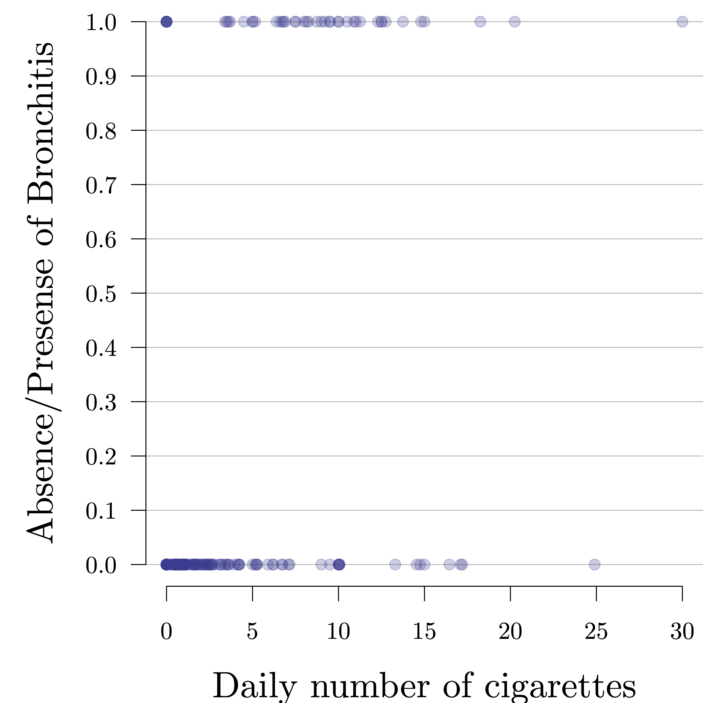
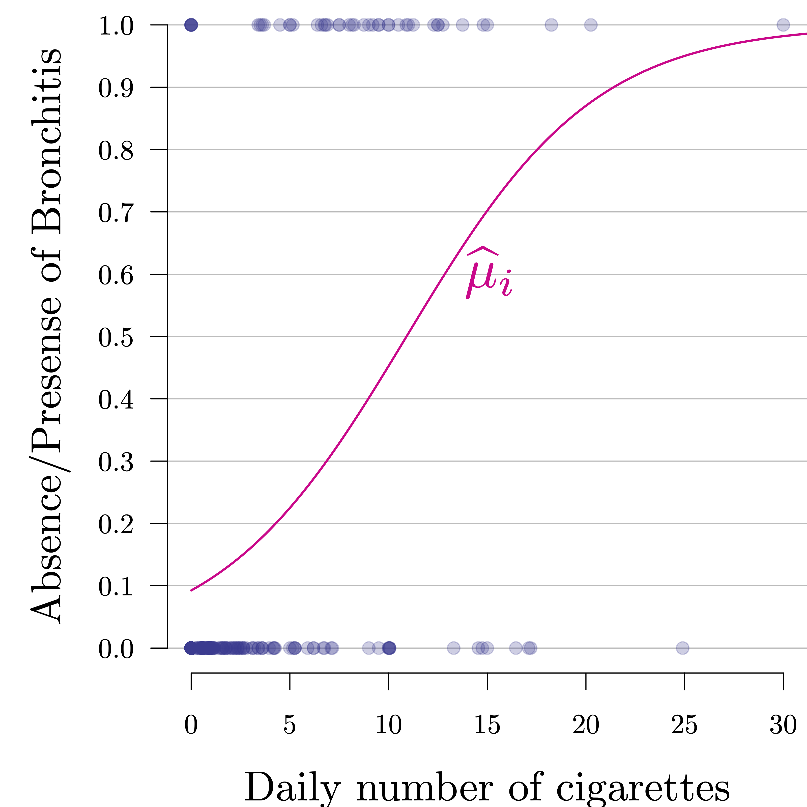

```{R, setup, include = F}
# devtools::install_github("dill/emoGG")
library(pacman)
p_load(
  broom, tidyverse,
  latex2exp, ggplot2, ggthemes, ggforce, viridis, extrafont, gridExtra,
  kableExtra, snakecase, janitor,
  data.table, dplyr, estimatr,
  lubridate, knitr, parallel,
  lfe,
  here, magrittr
)
# Define pink color
red_pink <- "#e64173"
turquoise <- "#20B2AA"
orange <- "#FFA500"
red <- "#fb6107"
blue <- "#2b59c3"
green <- "#8bb174"
grey_light <- "grey70"
grey_mid <- "grey50"
grey_dark <- "grey20"
grey = "#b4b4b4"
purple <- "#6A5ACD"
slate <- "#314f4f"
blue2 <- "#06bcf1"
# Dark slate grey: #314f4f
# Knitr options
opts_chunk$set(
  comment = "#>",
  fig.align = "center",
  fig.height = 7,
  fig.width = 10.5,
  warning = F,
  message = F
)
opts_chunk$set(dev = "svg")
options(device = function(file, width, height) {
  svg(tempfile(), width = width, height = height)
})
options(crayon.enabled = F)
options(knitr.table.format = "html")
# A blank theme for ggplot
theme_empty <- theme_bw() + theme(
  line = element_blank(),
  rect = element_blank(),
  strip.text = element_blank(),
  axis.text = element_blank(),
  plot.title = element_blank(),
  axis.title = element_blank(),
  plot.margin = structure(c(0, 0, -0.5, -1), unit = "lines", valid.unit = 3L, class = "unit"),
  legend.position = "none"
)
theme_simple <- theme_bw() + theme(
  line = element_blank(),
  panel.grid = element_blank(),
  rect = element_blank(),
  strip.text = element_blank(),
  axis.text.x = element_text(size = 18, family = "STIXGeneral"),
  axis.text.y = element_blank(),
  axis.ticks = element_blank(),
  plot.title = element_blank(),
  axis.title = element_blank(),
  # plot.margin = structure(c(0, 0, -1, -1), unit = "lines", valid.unit = 3L, class = "unit"),
  legend.position = "none"
)
theme_axes_math <- theme_void() + theme(
  text = element_text(family = "MathJax_Math"),
  axis.title = element_text(size = 22),
  axis.title.x = element_text(hjust = .95, margin = margin(0.15, 0, 0, 0, unit = "lines")),
  axis.title.y = element_text(vjust = .95, margin = margin(0, 0.15, 0, 0, unit = "lines")),
  axis.line = element_line(
    color = "grey70",
    size = 0.25,
    arrow = arrow(angle = 30, length = unit(0.15, "inches")
  )),
  plot.margin = structure(c(1, 0, 1, 0), unit = "lines", valid.unit = 3L, class = "unit"),
  legend.position = "none"
)
theme_axes_serif <- theme_void() + theme(
  text = element_text(family = "MathJax_Main"),
  axis.title = element_text(size = 22),
  axis.title.x = element_text(hjust = .95, margin = margin(0.15, 0, 0, 0, unit = "lines")),
  axis.title.y = element_text(vjust = .95, margin = margin(0, 0.15, 0, 0, unit = "lines")),
  axis.line = element_line(
    color = "grey70",
    size = 0.25,
    arrow = arrow(angle = 30, length = unit(0.15, "inches")
  )),
  plot.margin = structure(c(1, 0, 1, 0), unit = "lines", valid.unit = 3L, class = "unit"),
  legend.position = "none"
)
theme_axes <- theme_void() + theme(
  text = element_text(family = "Fira Sans Book"),
  axis.title = element_text(size = 18),
  axis.title.x = element_text(hjust = .95, margin = margin(0.15, 0, 0, 0, unit = "lines")),
  axis.title.y = element_text(vjust = .95, margin = margin(0, 0.15, 0, 0, unit = "lines")),
  axis.line = element_line(
    color = grey_light,
    size = 0.25,
    arrow = arrow(angle = 30, length = unit(0.15, "inches")
  )),
  plot.margin = structure(c(1, 0, 1, 0), unit = "lines", valid.unit = 3L, class = "unit"),
  legend.position = "none"
)
theme_set(theme_gray(base_size = 20))
# Column names for regression results
reg_columns <- c("Term", "Est.", "S.E.", "t stat.", "p-Value")
# Function for formatting p values
format_pvi <- function(pv) {
  return(ifelse(
    pv < 0.0001,
    "<0.0001",
    round(pv, 4) %>% format(scientific = F)
  ))
}
format_pv <- function(pvs) lapply(X = pvs, FUN = format_pvi) %>% unlist()
# Tidy regression results table
tidy_table <- function(x, terms, highlight_row = 1, highlight_color = "black", highlight_bold = T, digits = c(NA, 3, 3, 2, 5), title = NULL) {
  x %>%
    tidy() %>%
    select(1:5) %>%
    mutate(
      term = terms,
      p.value = p.value %>% format_pv()
    ) %>%
    kable(
      col.names = reg_columns,
      escape = F,
      digits = digits,
      caption = title
    ) %>%
    kable_styling(font_size = 20) %>%
    row_spec(1:nrow(tidy(x)), background = "white") %>%
    row_spec(highlight_row, bold = highlight_bold, color = highlight_color)
}
```

```{css, echo = F, eval = F}
@media print {
  .has-continuation {
    display: block !important;
  }
}
```

```{r xaringan-tile-view, echo=FALSE}
xaringanExtra::use_tile_view()
xaringanExtra::use_panelset()
xaringanExtra::use_clipboard()
xaringanExtra::use_extra_styles()
```


class: title-slide  
<div class="my-logo-right"></div>
<br>
<br>
<br>
<br>
 
# Data Analytics for Pharmaceutical Sciences

## Part IV: Generalized Linear Models 

### .smaller[Stéphane Guerrier, Data Analytics Lab, University of Geneva 🇨🇭]
### .smaller[Dominique-L. Couturier, Cancer Research UK, University of Cambridge 🇬🇧]
### .smaller[Yuming Zhang, Data Analytics Lab, University of Geneva 🇨🇭]

<br>
```{R, out.width = "25%", echo = F}
include_graphics("pics/liscence.png")
```
.center[.tiny[License: [CC BY NC SA 4.0](https://creativecommons.org/licenses/by-nc-sa/4.0/)]]

---

# .smallest[Motivation example: Bronchitis]

.panelset[
.panel[.panel-name[Problem]
A scientist is interested in studying the effects of smoking on being diagnosed with bronchitis. He collected 212 people for an experiment where he collected their daily number of smoked cigarettes. Then the scientist recorded the .pink[presence (encoded as 1)] or .purple2[absence (encoded as 0)] of bronchitis of each person as the outcome of the experiment. 

Based on these samples, the scientist wants to verify that smoking every day significantly contributes to the presence of bronchitis.
]
.panel[.panel-name[Data]
```{r}
dat = read.csv("data/bronchitis.csv")
head(dat$bron)
head(dat$cigs)
```
]
.panel[.panel-name[Graph]
```{r, echo = FALSE, out.width = "55%"}

```
]
]

---

# .smallest[Non-normal conditional distributions]

.smaller[In practice, we often encounter data which is actually not suitable for a linear model. For example,
1. A research is interested in studying the .blue[proportion] of individuals with a specific genetics mutation in different groups.
2. A hospital wants to investigate the .blue[number] of children diagnosed with an infectious disease per day.
3. A lab wants to analyze the .blue[probability] of myocardial infarction per treatment group.]

.smaller[In these cases, linear models are not suitable for two reasons:
1. .hi-pink[Non-linearity]: a linear model may give predicted values outside of the possible range (e.g. negative values for probability/proportion, decimal values for number of people).
2. .hi-pink[Heteroscedasticity]: the (conditional) variance of response is not constant and depends on its (conditional) mean.]

---

# .smallest[Solution: Generalized linear models]

- Recall that in linear regression, we consider
$$Y_i \color{#eb078e}{ \overset{iid}{\sim} \mathcal{N}}\left(\color{#373895}{\beta_0 + \sum_{j = 1}^p \beta_j X_{ij}}, \sigma^2\right).$$
- In .hi-pink[Generalized Linear Models (GLM)], we consider 
$$Y_i \color{#eb078e}{ \sim \text{distribution}}\left(\color{#eb078e}{f}\bigg(\color{#373895}{\beta_0 + \sum_{j = 1}^p \beta_j X_{ij}}\bigg), \phi\right),$$
where .pink[distribution] (classically) belongs to the .pink[exponential family], such as Bernoulli distribution or Poisson distribution. The function $\color{#eb078e}{f(\cdot)}$<sup>.smallest[👋]</sup> is monotonically increasing, and $\phi$ is a nuisance parameter related to the variance of $Y_i$ (which is typically also a function of $\mu_i$).

👋 .smallest[The function] $\small f(\cdot)$ .smallest[is actually the inverse of a function called the link function.]

---

# .smaller[Logistic regression]

- .smallest[.hi-pink[Logistic regression] is a classical example of GLM, and is most commonly used to model a binary response, where] $\small Y_i = 0$ .smallest[or] $\small 1$. 
- .smallest[It assumes that the response] $\small Y_i$ .smallest[follows a Bernoulli distribution with parameter] $\small \mu_i$ .smallest[such that] 
$\small \Pr(Y_i = 1) = \mu_i$ .smallest[and] $\small \Pr(Y_i = 0) = 1-\mu_i.$
- .smallest[The parameter] $\small \mu_i$.smallest[, i.e. the conditional mean of] $\small Y_i$.smallest[, is then modelled as a function of the covariates]
$\small \mu_i = \color{#eb078e}{f}\bigg(\color{#373895}{\beta_0 + \sum_{j = 1}^p \beta_j X_{ij}}\bigg).$ .smallest[In other words,] $$\small Y_i \color{#eb078e}{\sim \text{Bernoulli}}\left(\color{#eb078e}{f}\bigg(\color{#373895}{\beta_0 + \sum_{j = 1}^p \beta_j X_{ij}}\bigg), \phi\right), \quad \text{where} \;\; \phi=1.$$
- .smallest[The function] $\small f(\cdot)$ .smallest[allows to transform the whole real line to] $\small (0,1)$.smallest[, which makes unrestricted linear modeling possible. Some common choices of] $\small f(\cdot)$ .smallest[include:] 
1. .smallest[.hi-pink[Logit link]:] $\small f(z) = e^z / (1+e^z) \color{#b4b4b4}{= 1/(1+e^{-z})}$. 
2. .smallest[.hi-pink[Probit link]:] $\small f(z) = \Phi(z)$.smallest[, where] $\small \Phi(\cdot)$ .smallest[is the CDF of a] $\small \mathcal{N}(0,1)$.

---

# .smaller[Logistic regression]

Compared to linear regression, logistic regression makes .pink[more relaxed assumptions]:
1. The conditional mean $\mu_i$ is assumed to be a general (not necessarily linear) function of the covariates.
2. The errors are assumed to be independent. However, they do not need to be normally distributed and actually have different variance that depends on $\mu_i$. 

The parameters of the model (i.e. $\beta_0, \beta_1, \ldots, \beta_p$) are estimated by .pink[maximum likelihood estimation]. In practice, the Maximum Likelihood Estimator (MLE) has no closed-form solution and needs to be computed using .pink[iterative methods] such as the Newton-Raphson algorithm and the Iteratively ReWeighted Least Squares (IRWLS) algorithm. The details of these computational methods are beyond the scope of this class. 

---

# .smaller[Example: Bronchitis] 🚬

In the bronchitis example, using the logit link function, we can formulate a logistic regression model as follows:
$$\Pr(\color{#e64173}{\text{Bronchitis}_i} = 1 | \color{#6A5ACD}{\text{Cigarettes}_i}) = \frac{\exp(\beta_0 + \beta_1\color{#6A5ACD}{\text{Cigarettes}_i})}{1+\exp(\beta_0 + \beta_1\color{#6A5ACD}{\text{Cigarettes}_i})}.$$
- $\color{#e64173}{\text{Bronchitis}_i}$: indicator of the presence of bronchitis for the $i$-th person (i.e. $\color{#e64173}{\text{Bronchitis}_i} = 1$ if presence and $\color{#e64173}{\text{Bronchitis}_i} = 0$ if absence).
- $\color{#6A5ACD}{\text{Cigarettes}_i}$: the daily number of smoked cigarettes of the $i$-th person. 

We also name $\exp(\beta_0 + \beta_1\color{#6A5ACD}{\text{Cigarettes}_i})$ as the .blue[odds]<sup>.smallest[👋]</sup>, the linear combination of covariates $\beta_0 + \beta_1\color{#6A5ACD}{\text{Cigarettes}_i}$ as the .blue[log odds], and the coefficients to be .blue[log-odds ratios].

.smallest[👋 The odd related to a probability] $\small \pi$ .smallest[equals] $\small \pi/(1-\pi)$ .smallest[(the probability of success over the one of failure).]
---

# .smaller[Example: Bronchitis] 🚬

.panelset[
.panel[.panel-name[R Code]

In R, we use the function `glm(..., family=binomial(link="logit"))`.

Here is the code for our example:

```{r, eval = F}
# Import data (if you haven't already)
dat = read.csv("data/bronchitis.csv")

# Fit a logistic regression
mod1 = glm(bron ~ cigs, data = dat, family=binomial(link="logit"))
summary(mod1)
```

]
.panel[.panel-name[Output]

```{r, echo = F}
# Import data (if you haven't already)
dat = read.csv("data/bronchitis.csv")

# Fit a logistic regression
mod1 = glm(bron ~ cigs, data = dat, family=binomial(link="logit"))
summary(mod1)
```

]
]

---

# .smaller[Interpretation of estimated coefficients]

- $\hat{\beta}_0 = -2.2840$ represents the .blue[log odds] that a person is diagnosed with bronchitis when no cigarettes are consumed. Alternatively, the probability that a non-smoking person diagnosed with bronchitis is:

$$\frac{\exp(\hat{\beta}_0)}{1 + \exp(\hat{\beta}_0)} \approx \color{#eb078e}{9.25\%}.$$

- $\hat{\beta}_1 = 0.2094$ means that the .blue[log odds] of having bronchitis is estimated to .pink[increase by] 0.2094 by consuming one more cigarette. Therefore, the probability that a person .pink[consuming 20 cigarettes a day] to be diagnosed with bronchitis is 

$$\frac{\exp(\hat{\beta}_0 + \color{#eb078e}{20}\hat{\beta}_1)}{1 + \exp(\hat{\beta}_0 + \color{#eb078e}{20}\hat{\beta}_1)} \approx \color{#eb078e}{87.03\%}.$$

---

# .smaller[Interpretation of coefficients]

In general, the logistic model stipulates that the effect of a covariate on the chance of "success" is .pink[linear on the log odds scale, or multiplicative on the odds scale.]
- If $\beta_j > 0$ then $\exp(\beta_j) > 1$, and therefore the odds (probability) increases. 
- If $\beta_j < 0$ then $\exp(\beta_j) < 1$, and therefore the odds (probability) decreases.
- If $\beta_j = 0$ then $\exp(\beta_j) = 1$, which implies that the log odds is a constant function, and the response $Y_i$ is independent of the covariate $X_{ij}$.
- The .pink[magnitude] of $\beta_j$ (i.e. $|\beta_j|$) determines how fast the log odds increases or decreases as a function of the covariate $X_{ij}$.

---

# .smaller[Interpretation of coefficient p-values]

- Like for linear models, for each coefficient $\beta_j$, there is a corresponding p-value associated to the Wald test of $H_0: \beta_j = 0$ and $H_a: \beta_j \neq 0$. 
- .pink[A covariate with a small p-value (typically smaller than 5%) is considered to be a significant (meaningful) addition to the model], as changes in the values of such covariate can lead to changes in the response variable. 
- On the other hand, a large p-value (typically larger than 5%) suggests that the corresponding covariate is not (significantly) associated with changes in the response or that we don't have enough evidence (data) to show its effect.
- ⚠️ The Wald test for each coefficient $\beta_j$ of a GLM is analogous to a t-test for a coefficient in a linear regression. .pink[But there is a slight difference.] Unlike in a linear regression, there is generally no exact distribution theory for a GLM and we rely instead on large-sample approximations based on the asymptotic normality of the MLE. 🤓

---

# .smaller[Interpretation of coefficient p-values]

- .smallest[In this example, the coefficient p-value associated to the `Cigarettes` covariate is] $\small 2.59 \times 10^{-6}$.smallest[%. .purple[This suggests that whether people consume cigarettes every day makes a significant .hi-purple[difference] in the presence of bronchitis, compared to those who do not smoke, at the significance level of 5%.]] 
- .smallest[To further verify that smoking contributes to the presence of bronchitis, we can compute the p-value of a one-sided test using the following relations (like in linear regression):]

|               | $\small H_a: \beta_j>0$   | $\small H_a: \beta_j<0$  |
| ------------- |:-------------:| :-----:|
| $\small \hat{\beta_j}>0$     | $\small p/2$ | $\small 1-p/2$ |
| $\small \hat{\beta_j}<0$      | $\small 1-p/2$      |   $\small p/2$ |

.smallest[In this case,] $\small \hat{\beta}_1 = 0.2094$ .smallest[and] $\small p = 2.59 \times 10^{-6}$.smallest[%. So the p-value for the test] $\small H_0: \beta_1=0$ .smallest[and] $\small H_a = \beta_1 > 0$ .smallest[is] $\small 2.59 \times 10^{-6}\% /2 \approx 1.3 \times 10^{-6}\%  < \alpha$.smallest[. So we can conclude that smoking .pink[significantly contributes] to the presence of bronchitis.]

---

# .smaller[Model fit]

```{r, echo = FALSE, out.width = "65%"}

```

---

# .smaller[Example: Bronchitis] ☁️ 🏭 🚙 

The scientist points out that the .pink[environmental pollution] also plays an important role in the development of bronchitis. So he wants to consider the level of environmental pollution a person is exposed to as an additional covariate, which can be accessed as follows:

```{r}
head(dat$poll)
```

The scientist wants to know whether .pink[both smoking and environmental pollution contribute to the development of bronchitis.] 

---

# .smaller[Let's update our model]

Taking into account the new covariate `pollution`, we can update our model as follows:

$$\small \Pr(\color{#e64173}{\text{Bronchitis}_i} = 1| \color{#6A5ACD}{\text{Cigarettes}_i}, \color{#20B2AA}{\text{Pollution}_i}) = \frac{\exp(\beta_0 + \beta_1\color{#6A5ACD}{\text{Cigarettes}_i} + \beta_2\color{#20B2AA}{\text{Pollution}_i})}{1+\exp(\beta_0 + \beta_1\color{#6A5ACD}{\text{Cigarettes}_i} + \beta_2\color{#20B2AA}{\text{Pollution}_i})}.$$
- $\color{#e64173}{\text{Bronchitis}_i}$: indicator of the presence of bronchitis for the $i$-th person (i.e. $\color{#e64173}{\text{Bronchitis}_i} = 1$ if presence and $\color{#e64173}{\text{Bronchitis}_i} = 0$ if absence).
- $\color{#6A5ACD}{\text{Cigarettes}_i}$: the daily number of smoked cigarettes of the $i$-th person. 
- $\color{#20B2AA}{\text{Pollution}_i}$: the level of pollution that the $i$-th person is exposed to. 

The goal of the scientist is now to assess if both $\beta_1$ and $\beta_2$ are .pink[significantly larger than 0].

---

# .smaller[Example: Bronchitis]

.panelset[
.panel[.panel-name[R Code]

Here is the code to fit our second model: 

```{r}
# Import data (if you haven't already)
dat = read.csv("data/bronchitis.csv")
head(dat)
```

```{r, eval = F}
# Fit a logistic regression
mod2 = glm(bron ~ cigs + poll, data = dat, family=binomial(link="logit"))
summary(mod2)
```

]
.panel[.panel-name[Output]

```{r, echo = F}
# Fit a logistic regression
mod2 = glm(bron ~ cigs + poll, data = dat, family=binomial(link="logit"))
summary(mod2)
```

]
.panel[.panel-name[AIC]

```{r}
AIC(mod1)     # Cigarettes consumption
AIC(mod2)     # Cigarettes consumption + air pollution
```
]
]

---

# .smaller[Interpretation of estimated coefficients]

- $\hat{\beta}_0 = -10.0849$ represents the .blue[log odds] that a person is diagnosed with bronchitis when the person consumes no cigarettes and is not exposed to any pollution.
- $\hat{\beta}_1 = 0.2117$ means that the .blue[log odds] of having bronchitis is estimated to .pink[increase by] 0.2117 by consuming one more cigarette.
- $\hat{\beta}_2 = 0.1318$ means that the .blue[log odds] of having bronchitis is estimated to .pink[increase by] 0.1318 by being exposed to one more unit of pollution.
- Therefore, we can compute the following probabilities:

$$\frac{\exp(\hat{\beta}_0 + \color{#6A5ACD}{20}\hat{\beta}_1 + \color{#20B2AA}{65}\hat{\beta}_2)}{1 + \exp(\hat{\beta}_0 + \color{#6A5ACD}{20}\hat{\beta}_1 + \color{#20B2AA}{65}\hat{\beta}_2)} \approx {93.80\%},$$

$$\frac{\exp(\hat{\beta}_0 + \color{#6A5ACD}{10}\hat{\beta}_1 + \color{#20B2AA}{50}\hat{\beta}_2)}{1 + \exp(\hat{\beta}_0 + \color{#6A5ACD}{10}\hat{\beta}_1 + \color{#20B2AA}{50}\hat{\beta}_2)} \approx {20.13\%}.$$

---

# .smaller[Interpretation of estimated coefficients]

```{r, echo = FALSE}
library(plotly)
m = 40
mycigs = seq(from = 0, to = 30, length.out = m)
mypoll = seq(from = 40, to = 65, length.out = m)
probs = matrix(NA, m, m)

for (i in 1:m){
  for (j in 1:m){
    odds = exp(-10.08491 + 0.21169*mycigs[i] + 0.13176*mypoll[j])
    probs[i,j] = odds/(1 + odds)
  }
}

fig <- plot_ly(x = mycigs, y = mypoll, z = probs, type = "contour", contours = list(showlabels = TRUE)) %>% colorbar(title = "Estimated \n probability") %>% layout(xaxis = list(title = "Daily cigarettes consumption"), yaxis = list(title = "Pollution levels"))
fig
```

---

# .smaller[Interpretation of coefficient p-values]

We now consider whether both $\beta_1$ and $\beta_2$ are significantly greater than 0. 
- Since $\hat{\beta}_1 = 0.2117$ and the p-value of the two sided test is $2.83\times10^{-6}\%,$ we obtain the p-value for the one sided test $H_0: \beta_1 = 0$ and $H_a: \beta_1>0$ as $2.83\times10^{-6}\% / 2 \approx 1.42 \times10^{-6}\% < \alpha$, and therefore, $\beta_1$ is significantly greater than 0 at the significance level of $5\%$.
- Since $\hat{\beta}_2 = 0.1318$ and the p-value of the two sided test is $0.7113\%$, we obtain the p-value for the one sided test $H_0: \beta_2 = 0$ and $H_a: \beta_2>0$ as $0.7113\% / 2 \approx 0.3557\% < \alpha$, and therefore, $\beta_2$ is also significantly greater than 0 at the significance level of $5\%$.

Therefore, we conclude that .pink[both smoking cigarettes and environmental pollution significantly contribute to the development of bronchitis]. 

---

# .smaller[Poisson regression]

- .smallest[.hi-pink[Poisson regression] is another example of GLM that is used to model count data] $\small Y_i \in \mathbb{N}$.smallest[, such as a number of events occurring during a time interval or in a given area.]
- .smallest[It assumes that, during a time interval or in a given area, .purple2[the events occur independently at the same rate given the covariates.]]
- .smallest[The count response] $\small Y_i$ .smallest[can be modeled with a Poisson distribution with rate parameter] $\small \mu_i$ .smallest[such that] 
$\small \mu_i = \color{#eb078e}{\exp}\bigg(\color{#373895}{\beta_0 + \sum_{j = 1}^p \beta_j X_{ij}}\bigg)$.smaller[. Then]
$$\small Y_i \color{#eb078e}{\sim \text{Poisson}}\left(\color{#eb078e}{\exp}\bigg(\color{#373895}{\beta_0 + \sum_{j = 1}^p \beta_j X_{ij}}\bigg), \phi\right), \quad \text{where} \;\; \phi=1.$$
- .smallest[In R, we can use the function `glm(..., family=poisson)`.]
- .smallest[The Poisson regression has a restrictive assumption that the mean and variance of] $\small Y_i$ .smaller[are the same given the covariates. In practice, however, data are often overdispersed, exhibiting larger variance than the mean. This can be handled, for example, by the .hi-pink[negative binomial regression].]  

---

# Concluding remarks

- GLM extend the normal linear regression model in two ways:
1. It allows the response variable to .pink[come from an exponential family distribution]. Exponential family includes some of the most commonly used statistical models, including the normal, Bernoulli, and Poisson distributions. 
2. It allows the conditional mean of the response variable to vary linearly with the covariates .pink[through a monotonic transformation]. 
- In GLM, the parameters are estimated by the .pink[method of maximum likelihood]. In general, there are no closed-form solutions to the MLE so .pink[iterative methods] are used to compute the estimators.
- Like in linear regression, GLM .pink[only consider independent data], which sometimes may not be the case in practice. To consider dependent data, we can, for example, consider .hi-pink[generalized linear mixed models].
- All regression models .pink[should not be used to extrapolate.]

---

# .smaller[Exercise: Intensive care admission]

.panelset[
.panel[.panel-name[Problem]
We are interested in studying the predictability of the need of an admission to an intensive care unit of COVID 19 patients. For this purpose data were collected on patients admitted to emergency care facility in Belgium and used to assess their relationship to an admission to an intensive care unit during the course of the illness. The dataset is quite large and we will consider here a small subset: `ic` admission to intensive care unit (`0` for no, `1` for yes), `sex` gender of the patient (`0` for female, `1` for male), `age` age of the patient, `ldh` lactic acid dehydrogenase of the patient and `spo2`  oxygen saturation of the patient. Can you conclude that these variables are predictive for an admission to an intensive care unit?
]
.panel[.panel-name[Import]
```{r}
# Import data
covid = read.csv("data/covid.csv")

# First look
head(covid)
```
]
]

